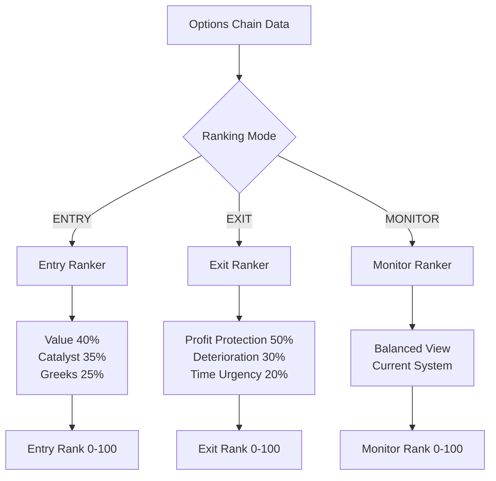

# Entry vs Exit Ranking System - Implementation Plan
## January 23, 2026

## 🎯 Core Philosophy

**Current Problem**: Single composite rank tries to be both entry and exit signal
**Solution**: Separate ranking modes optimized for different trading phases

---

## 📊 System Architecture



---

## 🚀 Phase 1: Core Infrastructure

### 1.1 Add Ranking Mode Enum

**Python** (`ml/src/models/options_momentum_ranker.py`):
```python
class RankingMode(Enum):
    """Ranking optimization modes."""
    ENTRY = "entry"      # Find undervalued opportunities
    EXIT = "exit"        # Detect when to take profit
    MONITOR = "monitor"  # Balanced view (current default)
```

**Swift** (`Models/OptionsRankingResponse.swift`):
```swift
enum RankingMode: String, Codable {
    case entry = "entry"
    case exit = "exit"
    case monitor = "monitor"
}
```

### 1.2 Add Mode to OptionRank Model

**Python** (`options_ranking_job.py`):
```python
{
    "ranking_mode": mode.value,  # "entry", "exit", or "monitor"
    "entry_rank": entry_composite,
    "exit_rank": exit_composite,
    "monitor_rank": composite_rank,  # Current system
}
```

**Swift** (`OptionsRankingResponse.swift`):
```swift
struct OptionRank: Codable {
    let compositeRank: Double         // Backward compat (monitor mode)
    let entryRank: Double?            // NEW
    let exitRank: Double?             // NEW
    let rankingMode: RankingMode?     // NEW
    // ... existing fields
}
```

---

## 📈 Phase 2: Entry Ranking System

### 2.1 Entry Weight Configuration

```python
ENTRY_MODE_WEIGHTS = {
    "value": 0.40,      # Is it cheap? (UP from 35%)
    "catalyst": 0.35,   # Why will it move? (NEW - replaces pure momentum)
    "greeks": 0.25,     # Is it positioned right? (unchanged)
}
```

### 2.2 Enhanced Value Scoring

**Current**: IV Rank + Spread
**Add**: 
- IV Percentile (more robust)
- Historical IV discount
- Contract price vs historical

```python
def _calculate_entry_value_score(self, df, iv_stats, options_history):
    # IV Percentile (40% of value) - NEW
    iv_percentile = self._calculate_iv_percentile(df, iv_stats)
    iv_percentile_score = 100 - iv_percentile
    
    # Historical IV Discount (30% of value) - NEW
    iv_discount_score = self._calculate_iv_discount(df, options_history)
    
    # Spread Quality (30% of value) - existing
    spread_score = self._calculate_spread_score(df['spread_pct'])
    
    return (
        iv_percentile_score * 0.40 +
        iv_discount_score * 0.30 +
        spread_score * 0.30
    )
```

### 2.3 Catalyst Scoring (NEW)

Replaces simple momentum with "Why now?" analysis:

```python
def _calculate_catalyst_score(self, df, options_history):
    # Price Momentum (40%) - directional move
    price_mom = self._calculate_price_momentum(df, options_history)
    
    # Volume Surge (35%) - NEW: ratio vs avg
    volume_surge = self._calculate_volume_surge(df, options_history)
    
    # OI Build (25%) - smart money accumulation
    oi_build = self._calculate_oi_growth(df, options_history)
    
    return (
        price_mom * 0.40 +
        volume_surge * 0.35 +
        oi_build * 0.25
    )

def _calculate_volume_surge(self, df, options_history):
    """Calculate volume as ratio vs historical average."""
    if options_history is None:
        return pd.Series(50.0, index=df.index)
    
    # Get 20-day average volume per contract
    hist_vol_avg = options_history.groupby('contract_symbol')['volume'].mean()
    
    current_vol = df['volume']
    avg_vol = df['contract_symbol'].map(hist_vol_avg)
    
    # Volume surge ratio
    vol_ratio = current_vol / avg_vol.clip(lower=1)
    
    # Score: 1× = 50, 2× = 75, 4× = 100, >4× = 100
    score = np.where(
        vol_ratio >= 4.0, 100,
        np.where(vol_ratio >= 2.0, 50 + (vol_ratio - 2.0) * 12.5, 
                 50 + (vol_ratio - 1.0) * 25)
    )
    
    return pd.Series(score, index=df.index).clip(0, 100)
```

### 2.4 Entry Greeks Scoring

Keep current delta/gamma/vega/theta logic (already good for entry)

---

## 📉 Phase 3: Exit Ranking System

### 3.1 Exit Weight Configuration

```python
EXIT_MODE_WEIGHTS = {
    "profit_protection": 0.50,  # Have I made enough?
    "deterioration": 0.30,      # Is momentum fading?
    "time_urgency": 0.20,       # Am I running out of time?
}
```

### 3.2 Profit Protection Scoring (NEW)

```python
def _calculate_profit_protection_score(self, df, position_entry_data):
    """Score based on profit achieved and target thresholds."""
    
    # Get entry price from position data (if available)
    entry_price = df.get('entry_price', df['mid'] * 0.7)  # Assume 30% gain if unknown
    current_price = df['mid']
    
    # Calculate P&L %
    pnl_pct = ((current_price - entry_price) / entry_price) * 100
    
    # Score thresholds:
    # <10%: 20 (hold)
    # 10-25%: 40-60 (consider)
    # 25-50%: 60-80 (good exit)
    # 50-100%: 80-95 (strong exit)
    # >100%: 95-100 (take profit!)
    
    score = np.where(
        pnl_pct >= 100, 100,
        np.where(pnl_pct >= 50, 80 + (pnl_pct - 50) * 0.3,
        np.where(pnl_pct >= 25, 60 + (pnl_pct - 25) * 0.8,
        np.where(pnl_pct >= 10, 40 + (pnl_pct - 10) * 1.33,
                 20 + pnl_pct * 2)))
    )
    
    # IV expansion bonus (30% of score)
    entry_iv = df.get('entry_iv', df['iv'] * 0.9)
    iv_expansion = ((df['iv'] - entry_iv) / entry_iv) * 100
    iv_bonus = np.clip(iv_expansion * 2, 0, 30)
    
    # Price target hit (if provided)
    price_target = df.get('price_target')
    underlying_price = df.get('underlying_price')
    target_bonus = np.where(
        (price_target.notna()) & (underlying_price >= price_target),
        20,  # Hit target = +20 points
        0
    )
    
    return pd.Series(score, index=df.index) * 0.50 + iv_bonus * 0.30 + target_bonus * 0.20
```

### 3.3 Deterioration Detection (NEW)

```python
def _calculate_deterioration_score(self, df, options_history):
    """Detect momentum decay and warning signs."""
    
    # Momentum Decay (40%) - is price action weakening?
    recent_3d_return = self._calculate_return(df, options_history, days=3)
    rolling_5d_return = self._calculate_return(df, options_history, days=5)
    
    momentum_decay = recent_3d_return < rolling_5d_return
    decay_magnitude = (rolling_5d_return - recent_3d_return).clip(0, 20)
    
    decay_score = np.where(momentum_decay, 100 - decay_magnitude * 3, 50)
    
    # Volume Drying Up (30%) - is interest fading?
    vol_trend = self._calculate_volume_trend(df, options_history)
    volume_score = np.where(vol_trend < 0, 100 + vol_trend * 2, 50)
    
    # OI Stalling (30%) - smart money exiting?
    oi_trend = self._calculate_oi_trend(df, options_history)
    oi_score = np.where(oi_trend < 0, 100 + oi_trend * 2, 50)
    
    return (
        decay_score * 0.40 +
        volume_score * 0.30 +
        oi_score * 0.30
    )
```

### 3.4 Time Urgency Scoring (NEW)

```python
def _calculate_time_urgency_score(self, df):
    """Score based on DTE remaining and theta burn."""
    
    dte = df.get('dte', df.get('days_to_expiry', 30))
    
    # DTE urgency (60%)
    # >30 DTE: 20 (no urgency)
    # 14-30 DTE: 40 (monitor)
    # 7-14 DTE: 70 (consider exit)
    # <7 DTE: 95 (urgent exit)
    
    dte_score = np.where(
        dte < 7, 95,
        np.where(dte < 14, 70 + (14 - dte) * 3.57,
        np.where(dte < 30, 40 + (30 - dte) * 1.875,
                 20))
    )
    
    # Theta burn rate (40%)
    theta = df.get('theta', -0.10)
    mid_price = df.get('mid', 1.0)
    theta_pct = np.abs(theta / mid_price) * 100  # Daily decay %
    
    # >3% daily: 100 (exit now)
    # 2-3% daily: 80
    # 1-2% daily: 60
    # <1% daily: 30
    
    theta_score = np.where(
        theta_pct >= 3.0, 100,
        np.where(theta_pct >= 2.0, 80 + (theta_pct - 2.0) * 20,
        np.where(theta_pct >= 1.0, 60 + (theta_pct - 1.0) * 20,
                 30 + theta_pct * 30))
    )
    
    return pd.Series(dte_score * 0.60 + theta_score * 0.40, index=df.index)
```

---

## 🔄 Phase 4: Integration & API

### 4.1 Update rank_options() Method

```python
def rank_options(
    self,
    df: pd.DataFrame,
    mode: RankingMode = RankingMode.MONITOR,
    iv_stats: Optional[IVStatistics] = None,
    options_history: Optional[pd.DataFrame] = None,
    position_entry_data: Optional[pd.DataFrame] = None,
) -> pd.DataFrame:
    """Rank options with mode-specific logic."""
    
    if mode == RankingMode.ENTRY:
        return self._rank_for_entry(df, iv_stats, options_history)
    elif mode == RankingMode.EXIT:
        return self._rank_for_exit(df, options_history, position_entry_data)
    else:  # MONITOR (default, backward compatible)
        return self._rank_monitor(df, iv_stats, options_history)

def _rank_for_entry(self, df, iv_stats, options_history):
    """Entry-optimized ranking."""
    df = self._calculate_entry_value_score(df, iv_stats, options_history)
    df = self._calculate_catalyst_score(df, options_history)
    df = self._calculate_greeks_scores(df)
    
    df['entry_rank'] = (
        df['entry_value_score'] * 0.40 +
        df['catalyst_score'] * 0.35 +
        df['greeks_score'] * 0.25
    )
    return df

def _rank_for_exit(self, df, options_history, position_entry_data):
    """Exit-optimized ranking."""
    df = self._calculate_profit_protection_score(df, position_entry_data)
    df = self._calculate_deterioration_score(df, options_history)
    df = self._calculate_time_urgency_score(df)
    
    df['exit_rank'] = (
        df['profit_protection_score'] * 0.50 +
        df['deterioration_score'] * 0.30 +
        df['time_urgency_score'] * 0.20
    )
    return df
```

### 4.2 API Endpoint Updates

**Backend** (`backend/supabase/functions/options-rankings/index.ts`):
```typescript
// Add mode parameter
const mode = url.searchParams.get('mode') || 'monitor';

// Call Python with mode
const rankings = await fetch('ML_SERVICE/rank', {
    method: 'POST',
    body: JSON.stringify({
        symbol,
        mode,  // NEW
        ...otherParams
    })
});
```

**Frontend** (`APIClient.swift`):
```swift
func fetchOptionsRankings(
    symbol: String,
    mode: RankingMode = .monitor  // NEW parameter
) async throws -> OptionsRankingsResponse {
    var components = URLComponents(string: "\(baseURL)/options-rankings")!
    components.queryItems = [
        URLQueryItem(name: "symbol", value: symbol),
        URLQueryItem(name: "mode", value: mode.rawValue)  // NEW
    ]
    // ... rest of implementation
}
```

---

## 🎨 Phase 5: Frontend UI Updates

### 5.1 Add Mode Selector in Options Tab

```swift
// In OptionsChainView or OptionsRankerView
@State private var rankingMode: RankingMode = .entry

var body: some View {
    VStack {
        // Mode selector at top
        Picker("Ranking Mode", selection: $rankingMode) {
            Text("Find Entry").tag(RankingMode.entry)
            Text("Manage Exit").tag(RankingMode.exit)
            Text("Monitor").tag(RankingMode.monitor)
        }
        .pickerStyle(.segmented)
        .padding()
        
        // Rankings list shows appropriate rank
        ForEach(rankings) { rank in
            RankedOptionRow(
                rank: rank,
                displayRank: rankForMode(rank, mode: rankingMode)
            )
        }
    }
}

func rankForMode(_ rank: OptionRank, mode: RankingMode) -> Double {
    switch mode {
    case .entry: return rank.entryRank ?? rank.compositeRank
    case .exit: return rank.exitRank ?? rank.compositeRank
    case .monitor: return rank.compositeRank
    }
}
```

### 5.2 Update Contract Workbench

**Overview Tab** - Show all three ranks:
```swift
VStack(alignment: .leading) {
    Text("Rankings by Mode")
        .font(.headline)
    
    HStack {
        VStack {
            Text("Entry")
            Text("\(Int(rank.entryRank ?? 0))")
                .font(.title2)
                .foregroundColor(.green)
        }
        
        VStack {
            Text("Exit")
            Text("\(Int(rank.exitRank ?? 0))")
                .font(.title2)
                .foregroundColor(.red)
        }
        
        VStack {
            Text("Monitor")
            Text("\(Int(rank.compositeRank))")
                .font(.title2)
                .foregroundColor(.blue)
        }
    }
}
```

**Why Ranked Tab** - Show mode-specific breakdown:
```swift
if rankingMode == .entry {
    // Show: Value 40%, Catalyst 35%, Greeks 25%
} else if rankingMode == .exit {
    // Show: Profit Protection 50%, Deterioration 30%, Time Urgency 20%
} else {
    // Show: Momentum 40%, Value 35%, Greeks 25%
}
```

---

## 📊 Phase 6: Position Tracking (For Exit Mode)

To make exit ranking work, need to track entry data:

### 6.1 Add Positions Table (Supabase)

```sql
CREATE TABLE user_positions (
    id UUID PRIMARY KEY DEFAULT uuid_generate_v4(),
    user_id UUID REFERENCES auth.users NOT NULL,
    contract_symbol TEXT NOT NULL,
    symbol TEXT NOT NULL,
    side TEXT NOT NULL CHECK (side IN ('call', 'put')),
    strike NUMERIC NOT NULL,
    expiration DATE NOT NULL,
    
    -- Entry data
    entry_date TIMESTAMPTZ NOT NULL DEFAULT NOW(),
    entry_price NUMERIC NOT NULL,
    entry_iv NUMERIC,
    entry_delta NUMERIC,
    quantity INTEGER NOT NULL,
    
    -- Tracking
    status TEXT NOT NULL DEFAULT 'open' CHECK (status IN ('open', 'closed')),
    exit_date TIMESTAMPTZ,
    exit_price NUMERIC,
    exit_reason TEXT,
    
    -- Computed
    current_price NUMERIC,
    pnl_pct NUMERIC,
    days_held INTEGER,
    
    created_at TIMESTAMPTZ DEFAULT NOW(),
    updated_at TIMESTAMPTZ DEFAULT NOW(),
    
    UNIQUE(user_id, contract_symbol, status)
);

CREATE INDEX idx_user_positions_user_open 
    ON user_positions(user_id, status) 
    WHERE status = 'open';
```

### 6.2 Link Positions to Rankings

```python
def get_position_entry_data(user_id, contract_symbols):
    """Fetch entry data for open positions."""
    return supabase.table('user_positions').select(
        'contract_symbol, entry_price, entry_iv, entry_date'
    ).eq('user_id', user_id).eq('status', 'open').in_(
        'contract_symbol', contract_symbols
    ).execute()
```

---

## ✅ Implementation Checklist

### Phase 1: Infrastructure ⏸️
- [ ] Add RankingMode enum (Python + Swift)
- [ ] Update OptionRank model with entry_rank, exit_rank fields
- [ ] Add mode parameter to rank_options()
- [ ] Update API endpoints to accept mode

### Phase 2: Entry Ranking 🎯
- [ ] Implement IV percentile calculation
- [ ] Implement IV discount vs historical
- [ ] Refactor value scoring for entry mode
- [ ] Implement volume surge detection (ratio-based)
- [ ] Implement catalyst scoring
- [ ] Wire up entry_rank calculation

### Phase 3: Exit Ranking 🚪
- [ ] Implement profit protection scoring
- [ ] Implement deterioration detection
- [ ] Implement time urgency scoring
- [ ] Wire up exit_rank calculation
- [ ] Add position entry data handling

### Phase 4: Database & Tracking 💾
- [ ] Create user_positions table
- [ ] Add position entry tracking API
- [ ] Link positions to exit ranking

### Phase 5: Frontend 🎨
- [ ] Add mode selector to Options tab
- [ ] Update RankedOptionRow to show mode-specific rank
- [ ] Update Contract Workbench Overview tab
- [ ] Update Why Ranked tab for mode-specific breakdown
- [ ] Add "Add to Watchlist" / "Track Position" button

### Phase 6: Testing 🧪
- [ ] Add tests for entry ranking
- [ ] Add tests for exit ranking
- [ ] Add tests for mode switching
- [ ] Test with real data (AAPL)
- [ ] Validate ranking makes sense

---

## 📈 Expected Impact

### Entry Mode Benefits
- **Better value detection**: IV percentile + historical discount
- **Catalyst awareness**: Volume surge detection
- **Reduced false signals**: 40% weight on value vs 35% before

### Exit Mode Benefits
- **Profit discipline**: Clear exit signals at 25%, 50%, 100% gains
- **Decay detection**: Catches momentum fading before it's too late
- **Time management**: DTE urgency prevents expiration losses

### Overall
- **Actionable signals**: "Buy this" vs "Sell this" clarity
- **Reduced analysis paralysis**: Mode tells you what to focus on
- **Better trade outcomes**: Right tool for right phase

---

## 🚀 Rollout Strategy

### Week 1: Infrastructure
- Add mode enum and fields
- Update models and API
- Deploy with monitor mode as default (no behavior change)

### Week 2: Entry Mode
- Implement entry ranking
- Test on AAPL, TSLA, SPY
- Deploy as opt-in feature

### Week 3: Exit Mode (Requires Position Tracking)
- Implement position tracking
- Implement exit ranking
- Test with paper positions

### Week 4: Full Release
- Make mode selector prominent
- Add onboarding tooltips
- Monitor user adoption

---

## 💡 Future Enhancements

1. **Smart Mode Auto-Switch**: If you have open position in contract, auto-show exit mode
2. **Alerts**: "Exit rank >80" triggers notification
3. **Backtest**: Historical entry/exit rank correlation with profitability
4. **ML Optimization**: Learn optimal exit thresholds per user
5. **Portfolio View**: Aggregate exit ranks across all positions

---

## 📞 Questions Before Implementation

1. **Position Tracking**: Do we have user positions already tracked somewhere?
2. **Entry Data**: Can we access historical option prices for entry_price?
3. **Priority**: Start with Entry mode first (easier, no position tracking needed)?
4. **UI Placement**: Where should mode selector live? (Options tab top, or per-contract?)
5. **Backward Compat**: Keep monitor mode as default for existing users?

Let me know and I'll start implementation!
