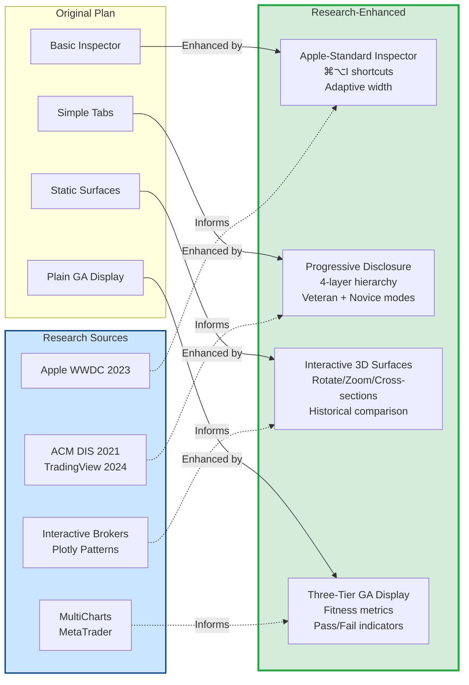
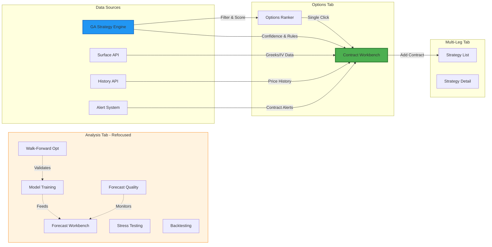

# Contract Workbench Implementation Plan
## 🔬 Research-Enhanced Edition

> **Plan Status**: Research-refined based on SwiftUI inspector patterns (Apple WWDC 2023), options trading UI design (ACM DIS 2021), progressive disclosure patterns (TradingView/Robinhood 2024), 3D visualization best practices (Interactive Brokers/Plotly), and GA optimization interfaces (MultiCharts/MetaTrader).

## 📊 Research Impact Summary

This plan has been enhanced with **5 major research areas**:

1. ✅ **SwiftUI Inspector Patterns** - Width control, keyboard shortcuts, identifiable selection
2. ✅ **Options Trading UI Design** - Balance veteran/novice needs, workflow integration
3. ✅ **Progressive Disclosure** - 4-layer complexity hierarchy, selective feature enablement
4. ✅ **3D Visualization** - Interactive surfaces, cross-sectional analysis, performance optimization
5. ✅ **GA Parameter Display** - Three-tier presentation with visual fitness indicators

**Key improvements**: Adaptive interfaces, historical comparison mode, keyboard-first navigation, export capabilities, and accessibility enhancements.

---

## Overview
Implement a reusable Contract Workbench inspector panel for the Options Ranker that provides detailed contract analysis while keeping the ranker UI fast and scannable. Simultaneously refocus the Analysis tab to emphasize stateful, compute-heavy, and cross-cutting workflows.

**Design Philosophy**: Use Apple-recommended inspector patterns, progressive disclosure to balance complexity, and research-backed visualization techniques to create a professional-grade options analysis workbench that serves both novice and veteran traders.

---

## Before vs After Research



---

## User Decisions
- **Presentation**: Keep both modal and inspector (single-click opens inspector, double-click opens full modal)
- **Analysis Surfaces**: Remove Greeks/Volatility surfaces entirely from Analysis tab (only accessible via Contract Workbench)
- **Forecast Workbench**: Enhance existing ML Forecast Breakdown section with workbench-like features

## Key Features Discovered
During codebase analysis, we discovered several **existing, production-ready features** that should be integrated:

### ✅ Already Implemented (Ready to Integrate)
1. **GA Strategy System** - Genetic algorithm-optimized trading parameters with backtest results
   - Entry/exit conditions, risk management rules, fitness metrics
   - Already used in Options Ranker for filtering
   
2. **Multi-Leg Strategy Builder** - Full multi-leg options strategy management
   - 20+ strategy types (spreads, straddles, iron condors, etc.)
   - Position tracking, aggregate Greeks, P&L calculation
   - `AddToStrategySheet` already exists for adding contracts
   
3. **Option History Charts** - Historical mark price and IV visualization
   - Multiple timeframes (5d, 30d, 90d, all)
   - Statistics and trend analysis
   
4. **Strike Analysis** - Historical price comparison across expirations
   - Already in detail modal, ready to integrate
   
5. **Alert System** - Multi-leg alert framework can be adapted for individual contracts
   - Alert types: price, Greeks, expiration, volume, rank changes

### 🎯 High-Value Additions
- **GA Integration**: Show confidence score and strategy recommendations per contract
- **Add to Strategy**: One-click button to add contract to multi-leg strategies  
- **Price History**: Embed historical charts to identify discount opportunities
- **Contract Alerts**: Set up monitoring for price/Greeks/rank changes

These features will make the Contract Workbench a comprehensive decision-support tool, not just a details viewer.

---

## Plan Refinements Based on Research

### Original Plan → Research-Enhanced Plan

| Component | Original Approach | Research-Enhanced Approach | Source |
|-----------|------------------|---------------------------|---------|
| **Inspector Width** | Fixed 400-500px | Dynamic: min 350, ideal 450, max 700 with user memory | Apple WWDC 2023 |
| **Keyboard Shortcuts** | Not specified | Add `InspectorCommands()` for ⌘⌥I toggle | Apple WWDC 2023 |
| **Surface Visualization** | Basic 3D surface | Interactive rotation, zoom, cross-sectional analysis | IB/Plotly |
| **Nearby Mode** | ±3 strikes, ±2 expiries | Volatility smile capture with moneyness-based filtering | IB Research |
| **GA Display** | Simple list of parameters | Three-tier: Fitness → Rules → Risk with visual indicators | MultiCharts/MetaTrader |
| **Progressive Disclosure** | All tabs equal weight | Layer 1-4 complexity hierarchy with disclosure groups | TradingView/Robinhood |
| **User Segmentation** | Single UI for all | Balanced design for veterans (shortcuts) + novices (tooltips) | ACM DIS 2021 |
| **3D Interaction** | Not specified | Click-drag rotate, scroll zoom, right-click options | Plotly Best Practices |
| **Performance** | Generic lazy loading | 200-point limit, WebWorkers, 2D fallback, 5min cache | Industry Standards |
| **Accessibility** | Basic VoiceOver | 2D alternatives, keyboard nav, high-contrast, WCAG AA | Apple HIG |

### Key Additions From Research

**1. Multi-Layout Synchronization** (TradingView Pattern)
- Sync workbench with chart view (same contract highlighted)
- Sync surface visualization with ranker filters
- Coordinate time periods across all views

**2. Historical Comparison Mode** (Interactive Brokers)
- Side-by-side current vs historical surfaces
- Identify volatility regime changes
- Spot arbitrage opportunities

**3. Adaptive Interface** (ACM DIS 2021)
- `@AppStorage("showAdvancedControls")` for user preference
- Power user mode with compact layouts
- Guided mode with helpful tooltips

**4. Keyboard-First Navigation** (Veteran Trader Need)
- ⌘⌥I: Toggle inspector
- ⌘[1-7]: Switch tabs
- ⌘R: Refresh data
- ESC: Close inspector

**5. Export & Documentation** (Professional Workflow)
- Export surface as PNG
- Copy GA parameters as text
- Save notes with contract snapshot
- Generate trade journal entry

---

## Research-Backed Design Principles

Based on SwiftUI inspector patterns, options trading UI research, and progressive disclosure best practices:

### 1. SwiftUI Inspector Pattern (Apple WWDC 2023)
- **Context-dependent presentation**: Trailing sidebar on macOS/iPad, sheet on compact sizes
- **Width control**: Use `.inspectorColumnWidth(min:ideal:max:)` for optimal layout
- **Keyboard shortcuts**: Implement `InspectorCommands()` for standard show/hide (⌘⌥I)
- **Custom selection**: Bridge boolean binding to optional identifiable items for better state management
- **Memory**: System remembers user's width adjustments

### 2. Options Trading Interface Design (ACM DIS 2021)
- **Options chain as cornerstone**: The ranker is the primary workflow entry point
- **Balance competing needs**: Veterans need speed/power, novices need clarity
- **Workflow integration**: Seamless connection to multi-leg strategies and analysis tools
- **Responsive layouts**: Support varying window sizes without loss of functionality
- **Mixed audience design**: Provide competitive parity for experts while maintaining accessibility

### 3. Progressive Disclosure (TradingView/Robinhood 2024)
- **Layered complexity**: Start simple, allow users to add depth as needed
- **Selective indicators**: Enable features on-demand rather than showing everything
- **Multi-layout synchronization**: Coordinate data across views (chart, ranker, workbench)
- **Granular exploration**: Support zoom/pan to specific time periods or data ranges
- **Contextual controls**: Show relevant options based on selected tab/mode

### 4. Greeks & IV Visualization (Interactive Brokers)
- **3D interactive surfaces**: Use Plotly-style click-drag rotation and scroll zoom
- **Cross-sectional analysis**: Show volatility skew across moneyness and time
- **Side-by-side comparison**: Historical vs current surfaces
- **Nearby vs whole chain**: Filter to relevant strikes (±3 strikes, ±2 expiries)
- **Volatility smile patterns**: Visualize term structure relationships

### 5. GA Strategy Display (MultiCharts/MetaTrader)
- **Three-tier presentation**:
  1. **Fitness metrics** (win rate, Sharpe, drawdown) - at-a-glance quality
  2. **Entry/exit rules** (thresholds, timing) - actionable criteria
  3. **Risk parameters** (position size, max trades) - risk management
- **Visual confidence indicators**: Color-coded quality scores (Excellent/Good/Fair/Poor)
- **Parameter ranges**: Show min/max/optimal for key thresholds
- **Backtest context**: Display training period, sample size, generations

## Workbench Architecture

```mermaid
graph TB
    Ranker[Options Ranker List]
    Workbench[Contract Workbench Inspector]
    
    Ranker -->|Single Click| Workbench
    Ranker -->|Double Click| Modal[Full Screen Modal]
    
    Workbench --> Overview[Overview Tab]
    Workbench --> WhyRanked[Why Ranked Tab]
    Workbench --> Contract[Contract Tab]
    Workbench --> Surfaces[Surfaces Tab]
    Workbench --> Risk[Risk Tab]
    Workbench --> Alerts[Alerts Tab]
    Workbench --> Notes[Notes Tab]
    
    Overview --> Scores[Momentum/Value/Greeks Scores]
    Overview --> GAConf[GA Confidence Badge]
    Overview --> MiniChart[Mini Underlying Chart]
    Overview --> QuickFacts[Quick Facts Grid]
    
    WhyRanked --> Contrib[Signal Contributions]
    WhyRanked --> Quality[Quality Adjustments]
    WhyRanked --> GAStrat[GA Strategy Details]
    
    Contract --> Details[Full Contract Details]
    Contract --> History[Price History Charts]
    Contract --> Strike[Strike Analysis]
    
    Surfaces --> IVSurf[Volatility Surface]
    Surfaces --> GreeksSurf[Greeks Surface]
    Surfaces --> Scope[Nearby/Whole Chain Toggle]
    
    Risk --> Payoff[Payoff Diagram]
    Risk --> PnL[P&L Calculator]
    Risk --> IVShock[IV Shock Scenarios]
    Risk --> TimeDecay[Time Decay Simulator]
    
    Alerts --> AlertList[Active Alerts]
    Alerts --> CreateAlert[Alert Creator]
    Alerts --> AlertTypes[Price/Greeks/Rank/Expiry]
    
    Notes --> Journal[Free Text Journal]
    Notes --> Tags[Strategy Tags]
    Notes --> HistoryLog[Notes History]
    
    Workbench -.->|Add to| MultiLeg[Multi-Leg Strategy]
    GAStrat -.->|Powered by| GAEngine[GA Strategy Engine]
```



---

## Feature Integration Summary

| Feature | Location | Integration Point | Complexity | Priority | Benefit |
|---------|----------|-------------------|------------|----------|---------|
| **GA Strategy Confidence** | `GAStrategyModels.swift` | Why Ranked tab | Low | High | Show ML-optimized entry/exit rules |
| **GA Entry/Exit Rules** | `GAStrategyModels.swift` | Why Ranked tab | Low | High | Actionable trading recommendations |
| **Add to Strategy** | `AddToStrategySheet.swift` | Header button | Low | High | Quick multi-leg strategy building |
| **Option History Chart** | `OptionHistoryChartView.swift` | Contract tab | Medium | Medium | Identify discount opportunities |
| **Strike Analysis** | `StrikeAnalysisView.swift` | Contract tab | Low | Low | Already in modal, just maintain |
| **Contract Alerts** | New (inspired by `MultiLegModels`) | Alerts tab | High | Medium | Automated monitoring |
| **Volatility Surface** | `VolatilitySurfaceView.swift` | Surfaces tab | Medium | Medium | IV analysis across chain |
| **Greeks Surface** | `GreeksSurfaceView.swift` | Surfaces tab | Medium | Medium | Greeks analysis across chain |
| **Risk Analysis** | New | Risk tab | High | Medium | P&L and scenario modeling |
| **Notes & Journal** | New | Notes tab | Medium | Low | Trade documentation |

### Implementation Priorities

**Phase 1 (Must Have)**:
- Core workbench structure
- Overview, Why Ranked, Contract tabs
- GA Strategy integration
- Add to Strategy button

**Phase 2 (Should Have)**:
- Surfaces tab with IV/Greeks
- Option History Chart
- Risk tab (basic payoff)

**Phase 3 (Nice to Have)**:
- Contract Alerts system
- Notes & Journal
- Advanced risk scenarios

---

## Phase 1: Data Models and State Management

### 1.1 Create SelectedContractState
**File**: `client-macos/SwiftBoltML/Models/SelectedContractState.swift` (new)

Create an `ObservableObject` that holds:
- `selectedRankId: String?` - currently selected rank ID
- `selectedRank: OptionRank?` - full contract snapshot
- `workbenchTab: ContractWorkbenchTab` - active tab (persisted per session)
- `surfaceScope: SurfaceScope` - "nearby" or "wholeChain"
- `surfaceMetric: SurfaceMetric` - IV, Delta, Gamma, Vega, Theta
- `isWorkbenchPresented: Bool` - inspector visibility state

### 1.2 Define ContractWorkbenchTab Enum
**File**: Same as above

```swift
enum ContractWorkbenchTab: String, CaseIterable, Identifiable {
    case overview
    case whyRanked
    case contract
    case surfaces
    case risk
    case notes
    
    var id: String { rawValue }
    var displayName: String { ... }
}

enum SurfaceScope: String {
    case nearby
    case wholeChain
}

enum SurfaceMetric: String, CaseIterable {
    case iv, delta, gamma, vega, theta
}
```

### 1.3 Add State to AppViewModel
**File**: `client-macos/SwiftBoltML/ViewModels/AppViewModel.swift`

Add property:
```swift
@Published var selectedContractState = SelectedContractState()
```

---

## Phase 2: Contract Workbench View Structure

### 2.1 Create ContractWorkbenchView
**File**: `client-macos/SwiftBoltML/Views/ContractWorkbenchView.swift` (new)

Structure:
```
ScrollView {
    VStack {
        // Header (persistent)
        ContractWorkbenchHeader(rank, dismiss)
        
        // Key Metrics Strip
        KeyMetricsStrip(rank)
        
        // Tab Picker
        Picker("", selection: $selectedTab) {
            ForEach(ContractWorkbenchTab.allCases) { tab in
                Text(tab.displayName).tag(tab)
            }
        }
        .pickerStyle(.segmented)
        
        // Tab Content
        switch selectedTab {
        case .overview: OverviewTabView(rank)
        case .whyRanked: WhyRankedTabView(rank)
        case .contract: ContractTabView(rank)
        case .surfaces: SurfacesTabView(rank, symbol)
        case .risk: RiskTabView(rank)
        case .notes: NotesTabView(rank)
        }
    }
}
```

**Dimensions**: 
- Inspector width: 400-500px (resizable)
- Min height: 600px

### 2.2 Create ContractWorkbenchHeader
**File**: `client-macos/SwiftBoltML/Views/Workbench/ContractWorkbenchHeader.swift` (new)

Display:
- Composite rank badge (100, green badge)
- Signal label (Strong Buy)
- Contract description: `AAPL $90.00 PUT`
- Expiry: `Expires Jun 16, 2027`
- Freshness pill: `Fresh: 2m`
- Close button

### 2.3 Create KeyMetricsStrip
**File**: `client-macos/SwiftBoltML/Views/Workbench/KeyMetricsStrip.swift` (new)

Display chips in 2-3 rows:
- Mark, Bid/Ask, Spread%, IV Rank
- Delta, OI, Volume, DTE

Each chip: label + value with appropriate color coding

---

## Phase 3: Tab Content Views

### 3.1 OverviewTabView
**File**: `client-macos/SwiftBoltML/Views/Workbench/OverviewTabView.swift` (new)

Content:
- **Momentum Framework Breakdown**: 3 horizontal bars (Momentum Score, Value Score, Greeks Score) with percentile values
- **Short Explanation**: 2-3 sentence summary of why this contract ranks high/low
- **Mini Chart**: Small underlying price chart (last 7 days) using existing chart data
- **Quick Facts Grid**: 
  - IV Rank: 45%
  - Spread Quality: Good (1.5%)
  - Open Interest: 5,000
  - Volume: 1,200
  - Liquidity: High

**Reference**: Can reuse logic from `OptionRankDetailView.swift` lines 120-180 (ML breakdown section)

### 3.2 WhyRankedTabView
**File**: `client-macos/SwiftBoltML/Views/Workbench/WhyRankedTabView.swift` (new)

Content:
- **Signal Contributions Table**:
  - Momentum Score: 82/100 (weight: 40%) → +32.8 points
  - Value Score: 75/100 (weight: 30%) → +22.5 points
  - Greeks Score: 80/100 (weight: 30%) → +24.0 points
  - **Total**: 79.3/100

- **Quality Adjustments**:
  - Liquidity Confidence: 0.85 → No penalty
  - Spread: 1.5% → No penalty
  - Stale Quote: 2m → No penalty

- **Active Signals**: DISCOUNT, GREEKS, BUY (display as badges)

- **Explanation Text**: "This contract ranks in the top 15% due to strong momentum alignment and favorable Greeks positioning. The underlying has shown positive 7-day momentum (+3.5%) with manageable volatility."

### 3.3 ContractTabView
**File**: `client-macos/SwiftBoltML/Views/Workbench/ContractTabView.swift` (new)

Display as labeled two-column form:
- **Basics**: Contract Symbol, Strike, Expiry, Side, DTE
- **Pricing**: Bid, Ask, Mark, Last, Spread, Spread%
- **Greeks**: Delta, Gamma, Theta, Vega, Rho
- **Volume/OI**: Volume, Open Interest, Vol/OI Ratio
- **IV Metrics**: Implied Vol, IV Rank
- **Liquidity**: Liquidity Confidence, Price Provider, OI Provider
- **History**: History Samples, Avg Mark, Window Days
- **Metadata**: Run At timestamp

**Reference**: Can reuse grid from `OptionRankDetailView.swift` lines 200-350 (contract details section)

### 3.4 SurfacesTabView (Research-Enhanced)
**File**: `client-macos/SwiftBoltML/Views/Workbench/SurfacesTabView.swift` (new)

Structure based on Interactive Brokers IV Viewer and 3D visualization best practices:

```swift
VStack(spacing: 12) {
    // Progressive Disclosure: Controls at top
    HStack {
        // Scope toggle (Nearby centers on selected contract)
        Picker("Scope", selection: $scope) {
            Label("Nearby", systemImage: "scope")
                .tag(SurfaceScope.nearby)
            Label("Whole Chain", systemImage: "rectangle.expand.vertical")
                .tag(SurfaceScope.wholeChain)
        }
        .pickerStyle(.segmented)
        .help("Nearby: ±3 strikes, ±2 expiries | Whole Chain: Full surface")
        
        Spacer()
        
        // Metric selector
        Picker("Metric", selection: $metric) {
            Text("IV").tag(SurfaceMetric.iv)
            Text("Δ").tag(SurfaceMetric.delta)
            Text("Γ").tag(SurfaceMetric.gamma)
            Text("Θ").tag(SurfaceMetric.theta)
            Text("V").tag(SurfaceMetric.vega)
        }
        .pickerStyle(.segmented)
    }
    
    // Comparison mode (inspired by IB side-by-side)
    if showComparison {
        Toggle("Compare Historical", isOn: $compareHistorical)
            .toggleStyle(.switch)
    }
    
    // Status line with data quality indicators
    HStack {
        Image(systemName: "checkmark.circle.fill")
            .foregroundColor(.green)
        Text("Loaded: \(contractCount) contracts")
        Text("•")
        Text("As of \(timestamp)")
        Spacer()
        Button {
            showInteractionHelp = true
        } label: {
            Image(systemName: "questionmark.circle")
        }
        .buttonStyle(.plain)
        .help("Click-drag: Rotate | Scroll: Zoom | Right-click: Options")
    }
    .font(.caption)
    .foregroundStyle(.secondary)
    
    Divider()
    
    // 3D Interactive Surface (Plotly-based)
    if metric == .iv {
        VolatilitySurfaceEmbedView(
            symbol: symbol,
            scope: scope,
            selectedContract: rank,
            showHistorical: compareHistorical
        )
        .overlay(alignment: .topTrailing) {
            // Volatility smile indicator
            if scope == .nearby {
                VStack(alignment: .trailing, spacing: 4) {
                    Text("ATM IV: \(atmIV, specifier: "%.1f")%")
                    Text("Skew: \(skew > 0 ? "+" : "")\(skew, specifier: "%.1f")%")
                }
                .font(.caption2)
                .padding(8)
                .background(.ultraThinMaterial)
                .cornerRadius(6)
                .padding(8)
            }
        }
    } else {
        GreeksSurfaceEmbedView(
            symbol: symbol,
            metric: metric,
            scope: scope,
            selectedContract: rank
        )
        .overlay(alignment: .topTrailing) {
            // Greeks value at selected contract
            GreeksValueBadge(rank: rank, metric: metric)
        }
    }
    
    // Cross-sectional analysis controls (collapsible)
    DisclosureGroup("Advanced: Cross-Sectional View") {
        HStack {
            Picker("Slice By", selection: $sliceMode) {
                Text("Moneyness (K/S)").tag(SliceMode.moneyness)
                Text("Time to Maturity").tag(SliceMode.timeToMaturity)
            }
            .pickerStyle(.segmented)
            
            Slider(value: $sliceValue, in: sliceRange)
                .frame(maxWidth: 200)
        }
    }
}
.task {
    // Lazy load when tab appears
    await loadSurfaceData()
}
```

**Implementation Details**:

**Nearby Mode** (based on volatility smile research):
- Center on selected contract's strike (moneyness = 1.0)
- Show ±3 strikes (captures smile curve)
- Show ±2 expiries (term structure context)
- Filter ~15-20 contracts (fast rendering)

**3D Interaction** (based on Plotly/IB patterns):
- Click-drag to rotate surface
- Scroll to zoom in/out
- Right-click for display options
- Hover for value tooltips
- Contour lines at z-axis intervals

**Cross-Sectional Analysis** (research-backed enhancement):
- Slice by moneyness: Shows skew across strikes for fixed expiry
- Slice by time: Shows term structure across expiries for fixed strike
- Interactive slider to adjust slice position

**Lazy Loading Strategy**:
- Use `.task` modifier to load only when tab is shown
- Cache results for 5 minutes
- Show loading skeleton while fetching
- Fallback to 2D heatmap if 3D rendering fails

**Files to Modify**:
- Extract chart rendering from `GreeksSurfaceView.swift` into `GreeksSurfaceChart.swift` (reusable)
- Extract chart rendering from `VolatilitySurfaceView.swift` into `VolatilitySurfaceChart.swift` (reusable)
- Create `SurfaceInteractionControls.swift` for consistent 3D navigation UI

### 3.5 RiskTabView
**File**: `client-macos/SwiftBoltML/Views/Workbench/RiskTabView.swift` (new)

Content:
- **Payoff Diagram**: Visual chart showing P&L at expiration for different underlying prices
- **Breakeven Analysis**: Calculate and display breakeven price(s)
- **P&L Calculator**: 
  - Slider: Underlying move (±20%)
  - Display: Expected P&L based on delta
- **IV Shock Scenarios**:
  - IV +10%, IV +20%
  - IV -10%, IV -20%
  - Show impact on contract value using vega
- **Time Decay Simulator**:
  - DTE slider (from current DTE to 0)
  - Show theta decay visualization
- **Risk Metrics**:
  - Max Profit: $X
  - Max Loss: $Y (or premium paid for long options)
  - Risk/Reward Ratio: 1:Z

**Implementation Note**: Start with basic payoff diagram and P&L calculator; can enhance with more sophisticated Greeks modeling later.

### 3.6 NotesTabView
**File**: `client-macos/SwiftBoltML/Views/Workbench/NotesTabView.swift` (new)

Features:
- **Free-text editor**: TextEditor for journaling about the contract
- **Tags**: Multi-select chips (e.g., "earnings play", "volatility crush", "tested strategy")
- **Timestamp**: Auto-save with "Last saved: X minutes ago"
- **History**: Show previous notes for same contract (if any)

**Data Storage**: Use UserDefaults or local SQLite/Core Data
- Key: `contract_notes_{contractSymbol}`
- Value: JSON with `{ text, tags, timestamp, symbol }`

---

## Phase 4: Wiring into Options Ranker

### 4.1 Modify AllContractsView
**File**: `client-macos/SwiftBoltML/Views/AllContractsView.swift`

Changes:
1. Remove local `@State private var selectedRank`
2. Inject `@EnvironmentObject var appViewModel: AppViewModel`
3. Update tap gesture (line ~148):
   ```swift
   .onTapGesture {
       appViewModel.selectedContractState.selectedRank = rank
       appViewModel.selectedContractState.isWorkbenchPresented = true
   }
   ```
4. Add double-tap gesture for modal:
   ```swift
   .onTapGesture(count: 2) {
       selectedModalRank = rank  // local state for modal
   }
   ```
5. Keep existing `.sheet(item: $selectedModalRank)` for modal presentation

### 4.2 Modify OptionsChainView (Research-Backed Pattern)
**File**: `client-macos/SwiftBoltML/Views/OptionsChainView.swift`

Add inspector modifier with Apple-recommended width control and keyboard shortcuts:

```swift
// Add to scene/window commands (AppDelegate or ContentView)
.commands {
    InspectorCommands() // Enables ⌘⌥I shortcut
}

// Add inspector to OptionsChainView
.inspector(isPresented: $appViewModel.selectedContractState.isWorkbenchPresented) {
    if let rank = appViewModel.selectedContractState.selectedRank {
        ContractWorkbenchView(
            rank: rank,
            symbol: symbol,
            allRankings: appViewModel.optionsRankerViewModel.rankings
        )
        .inspectorColumnWidth(
            min: 350,    // Minimum for readability
            ideal: 450,  // Optimal balance (user can resize)
            max: 700     // Maximum before becoming unwieldy
        )
        .presentationDetents([.medium, .large]) // For iPad sheet presentation
    }
}
```

**Rationale**: 
- Width range based on Apple's inspector guidelines and trading UI research
- System remembers user's width preference
- Keyboard shortcuts improve workflow efficiency for power users
- Presentation detents ensure good experience on iPad

### 4.3 Add Toolbar Button
**File**: `client-macos/SwiftBoltML/Views/OptionsChainView.swift`

Add to toolbar:
```swift
.toolbar {
    ToolbarItem(placement: .automatic) {
        Button {
            appViewModel.selectedContractState.isWorkbenchPresented.toggle()
        } label: {
            Label("Toggle Workbench", systemImage: "sidebar.right")
        }
        .disabled(appViewModel.selectedContractState.selectedRank == nil)
    }
}
```

### 4.4 Handle Selection Changes
**File**: `client-macos/SwiftBoltML/Views/ContractWorkbenchView.swift`

Add `onChange` modifier to refresh data when selection changes without dismissing inspector:
```swift
.onChange(of: selectedContractState.selectedRank?.id) { oldValue, newValue in
    // Refresh any tab-specific data
    // Reset to Overview tab (optional)
}
```

---

## Phase 5: Analysis Tab Refocus

### 5.1 Remove Surfaces from Analysis
**File**: `client-macos/SwiftBoltML/Views/AnalysisView.swift`

**Remove sections** (lines ~1026-1194):
- `GreeksSurfaceSection` (lines 1026-1096)
- `VolatilitySurfaceSection` (lines 1098-1194)

**Keep sections**:
- Alerts
- ML Forecast Breakdown (enhanced - see 5.2)
- Enhanced ML Insights
- Support & Resistance
- Technical Indicators (preview only)
- Model Training
- Walk-Forward Optimization
- Stress Testing
- Forecast Quality
- Backtesting
- Portfolio Optimization
- Technical Summary

### 5.2 Enhance ML Forecast Breakdown
**File**: `client-macos/SwiftBoltML/Views/AnalysisView.swift`

Current location: Lines ~200-300 (approximate)

Enhancements:
1. **Add "Forecast Workbench" header** with icon
2. **Add horizon selector** (if not already present): 1D, 1W, 1M buttons
3. **Add comparison mode**: Toggle to compare current forecast vs previous run
4. **Add confidence visualization**: Show forecast confidence range as shaded area
5. **Add "Save Forecast Snapshot" button**: Store forecast for later comparison
6. **Add "View Saved Forecasts" link**: Opens sheet with historical forecast runs

**New Model**:
```swift
struct ForecastSnapshot: Codable, Identifiable {
    let id: UUID
    let symbol: String
    let timestamp: Date
    let horizon: String
    let prediction: Double
    let confidence: Double
    let modelVersion: String
}
```

**Storage**: UserDefaults or local file: `forecast_snapshots.json`

### 5.3 Reorganize Analysis Sections
**File**: `client-macos/SwiftBoltML/Views/AnalysisView.swift`

New order (top to bottom):
1. **Alerts** (stays at top)
2. **Forecast Workbench** (enhanced ML Forecast Breakdown)
3. **Forecast Quality** (move up from bottom, emphasize cross-cutting monitoring)
4. **Model Training** (grouped with forecast)
5. **Walk-Forward Optimization** (grouped with training)
6. Divider - "Technical Analysis" header
7. **Enhanced ML Insights**
8. **Support & Resistance**
9. **Technical Indicators**
10. **Technical Summary**
11. Divider - "Portfolio & Risk" header
12. **Stress Testing**
13. **Backtesting**
14. **Portfolio Optimization**

Add section headers for better organization:
```swift
Text("ML Forecast & Training")
    .font(.headline)
    .padding(.top)
```

### 5.4 Update Navigation
**File**: `client-macos/SwiftBoltML/Views/AnalysisView.swift`

Add helper comment at top of file:
```swift
/// Analysis Tab - Focus Areas:
/// • Stateful: runs/jobs, saved experiments, audit trail
/// • Compute-heavy: training, stress tests, walk-forward validation
/// • Cross-cutting: forecast quality monitoring across symbols
///
/// Note: Contract-level surfaces (Greeks/IV) are in Options → Contract Workbench
```

### 5.5 Integration Flow Diagram



---

## Phase 6: Quality Assurance and Polish

### 6.1 Resize and Layout Testing
- Test inspector at various widths (400-600px)
- Verify content doesn't overflow or clip
- Test on different macOS window sizes (narrow vs wide)
- Ensure chart area and ranker remain usable with inspector open

### 6.2 Performance Optimization
- Lazy load Surfaces tab data (only fetch when tab is shown)
- Cache surface data per symbol (invalidate after 5 minutes)
- Ensure switching between contracts is fast (<100ms)
- Profile memory usage with inspector open/closed

### 6.3 User Flow Testing
1. Select symbol → Ranker loads → Single-click contract → Inspector opens → Navigate tabs → Close inspector → Selection persists
2. Select symbol → Ranker loads → Double-click contract → Modal opens → Close modal → Inspector state unchanged
3. Inspector open → Select different contract → Inspector updates without closing → All tabs refresh correctly
4. Inspector open → Switch to different symbol → Inspector closes or shows "Select a contract"
5. Analysis tab → Model Training → Run training → Results visible → Navigation back works

### 6.4 Error Handling
- Handle missing Greeks data gracefully in Surfaces tab
- Show "No data available" state in Risk tab if insufficient data
- Validate notes storage/retrieval with fallback to empty state
- Handle surface API failures without crashing inspector

### 6.5 Accessibility
- Add VoiceOver labels to all interactive elements
- Ensure keyboard navigation works in inspector
- Test with Reduce Motion enabled
- Verify color contrast ratios meet WCAG standards

---

## File Checklist

### New Files (15)
- [ ] `client-macos/SwiftBoltML/Models/SelectedContractState.swift`
- [ ] `client-macos/SwiftBoltML/Views/ContractWorkbenchView.swift`
- [ ] `client-macos/SwiftBoltML/Views/Workbench/ContractWorkbenchHeader.swift`
- [ ] `client-macos/SwiftBoltML/Views/Workbench/KeyMetricsStrip.swift`
- [ ] `client-macos/SwiftBoltML/Views/Workbench/OverviewTabView.swift`
- [ ] `client-macos/SwiftBoltML/Views/Workbench/WhyRankedTabView.swift`
- [ ] `client-macos/SwiftBoltML/Views/Workbench/ContractTabView.swift`
- [ ] `client-macos/SwiftBoltML/Views/Workbench/SurfacesTabView.swift`
- [ ] `client-macos/SwiftBoltML/Views/Workbench/GreeksSurfaceEmbedView.swift`
- [ ] `client-macos/SwiftBoltML/Views/Workbench/VolatilitySurfaceEmbedView.swift`
- [ ] `client-macos/SwiftBoltML/Views/Workbench/RiskTabView.swift`
- [ ] `client-macos/SwiftBoltML/Views/Workbench/NotesTabView.swift`
- [ ] `client-macos/SwiftBoltML/Models/ForecastSnapshot.swift` (optional)
- [ ] `client-macos/SwiftBoltML/Services/ForecastSnapshotStorage.swift` (optional)
- [ ] `client-macos/SwiftBoltML/ViewModels/ContractNotesViewModel.swift` (optional)

### Modified Files (5)
- [ ] `client-macos/SwiftBoltML/ViewModels/AppViewModel.swift`
- [ ] `client-macos/SwiftBoltML/Views/AllContractsView.swift`
- [ ] `client-macos/SwiftBoltML/Views/OptionsChainView.swift`
- [ ] `client-macos/SwiftBoltML/Views/AnalysisView.swift`
- [ ] `client-macos/SwiftBoltML/Views/OptionsRankerExpiryView.swift` (if it has selection logic)

### Refactored Files (2)
- [ ] `client-macos/SwiftBoltML/Views/GreeksSurfaceView.swift` (extract reusable chart component)
- [ ] `client-macos/SwiftBoltML/Views/VolatilitySurfaceView.swift` (extract reusable chart component)

---

## Implementation Order

### Sprint 1: Foundation (Days 1-2)
1. Create `SelectedContractState` model
2. Add state to `AppViewModel`
3. Create `ContractWorkbenchView` shell with tab picker
4. Create `ContractWorkbenchHeader` and `KeyMetricsStrip`
5. Wire up basic inspector presentation in `OptionsChainView`
6. Implement single-click selection in `AllContractsView`

### Sprint 2: Core Tabs (Days 3-5)
7. Implement `OverviewTabView` (reuse existing breakdown logic)
8. Implement `WhyRankedTabView` (signal contributions)
9. Implement `ContractTabView` (reuse existing details grid)
10. Add toolbar toggle button
11. Test selection flow and inspector behavior

### Sprint 3: Advanced Tabs (Days 6-8)
12. Refactor surface views to extract embeddable components
13. Implement `SurfacesTabView` with scope/metric controls
14. Implement basic `RiskTabView` (payoff diagram + P&L calc)
15. Implement `NotesTabView` with local storage
16. Test lazy loading and performance

### Sprint 4: Analysis Tab Refocus (Days 9-10)
17. Remove Greeks/Volatility surface sections from Analysis
18. Enhance ML Forecast Breakdown section
19. Reorganize Analysis sections with headers
20. Add forecast snapshot functionality (if time permits)
21. Update Analysis tab documentation

### Sprint 5: Polish & QA (Days 11-12)
22. Resize and layout testing across window sizes
23. Performance profiling and optimization
24. End-to-end user flow testing
25. Error handling and edge cases
26. Accessibility improvements
27. Documentation and inline comments

---

## Design Decisions & Rationale

### Why Inspector Over Modal?
- **Context preservation**: User can see ranker list while inspecting details
- **Faster iteration**: Single-click to switch between contracts
- **macOS native**: Inspector pattern is standard in Apple apps (Finder, Xcode, Mail)
- **Flexible**: Resizable, can be hidden when not needed

### Why Keep Modal Option?
- **Deep dives**: Double-click for full-screen detailed analysis
- **Comparison**: Can open multiple modals side-by-side (future enhancement)
- **User preference**: Some users prefer full focus on one contract

### Why Remove Surfaces from Analysis?
- **Context**: Surfaces are contract-specific, not cross-cutting
- **Clutter**: Analysis tab was becoming a dumping ground
- **Focus**: Analysis should emphasize ML/forecast quality, not individual contract Greeks

### Why Enhance Forecast Section?
- **Statefulness**: Saved snapshots create audit trail
- **Comparison**: See how forecast accuracy evolves
- **Workbench feel**: More interactive than passive display

### Why Lazy Load Surfaces?
- **Performance**: Surface API calls are expensive
- **UX**: Most users won't visit every tab for every contract
- **Bandwidth**: Reduce unnecessary API calls

---

## Additional Features to Integrate (RECOMMENDED)

Based on existing codebase analysis, the following features are **already implemented** and should be integrated into the workbench:

### 1. GA Strategy Integration (HIGH PRIORITY)
**Location**: `GAStrategyModels.swift`, already used in `OptionsRankerViewModel`

**What to add**:
- New tab: **Strategy** (or integrate into Why Ranked tab)
- Show GA confidence score for the contract: `rank.gaConfidence(strategy.genes)`
- Display if contract passes GA filters: `rank.passesGAFilters(strategy.genes)`
- Show strategy fitness metrics: Win Rate, Profit Factor, Sharpe Ratio, Max Drawdown
- Display entry conditions (rank thresholds, timing, IV rank range)
- Display exit conditions (profit target, stop loss, Greeks exits, max hold time)
- Show risk management rules (position size, max concurrent trades)

**UI Enhancement** (based on MultiCharts/MetaTrader GA optimization interfaces):

```swift
VStack(spacing: 16) {
    // Tier 1: Fitness Metrics (at-a-glance quality assessment)
    HStack(spacing: 20) {
        GAMetricCard(
            title: "Win Rate",
            value: fitness.winRateDisplay,
            color: fitness.winRate >= 0.6 ? .green : .orange
        )
        GAMetricCard(
            title: "Sharpe Ratio",
            value: fitness.sharpeDisplay,
            color: fitness.sharpeRatio >= 1.0 ? .green : .orange
        )
        GAMetricCard(
            title: "Max DD",
            value: fitness.maxDrawdownDisplay,
            color: fitness.maxDrawdown <= 0.15 ? .green : .red
        )
        GAMetricCard(
            title: "Quality",
            value: "\(fitness.qualityScore)/100",
            color: fitness.qualityColor
        )
    }
    
    // GA Confidence Badge (visual indicator)
    HStack {
        Circle()
            .fill(gaConfidenceColor)
            .frame(width: 12, height: 12)
        Text("GA Confidence: \(Int(gaConfidence * 100))%")
            .font(.headline)
        if passesGAFilters {
            Image(systemName: "checkmark.seal.fill")
                .foregroundColor(.green)
            Text("Passes Filters")
                .foregroundColor(.green)
        } else {
            Image(systemName: "xmark.seal.fill")
                .foregroundColor(.orange)
            Text("Outside Parameters")
                .foregroundColor(.orange)
        }
    }
    
    Divider()
    
    // Tier 2: Entry/Exit Rules (actionable criteria)
    GroupBox("Entry Conditions") {
        VStack(alignment: .leading, spacing: 8) {
            RuleRow(
                icon: "chart.line.uptrend.xyaxis",
                label: "Composite Rank",
                value: "≥ \(Int(genes.minCompositeRank))",
                passed: rank.effectiveCompositeRank >= genes.minCompositeRank
            )
            RuleRow(
                icon: "arrow.up.arrow.down",
                label: "IV Rank Range",
                value: genes.ivRankRangeDisplay,
                passed: isIVRankInRange()
            )
            RuleRow(
                icon: "flag.fill",
                label: "Signal Filter",
                value: genes.signalFilterDisplay,
                passed: matchesSignalFilter()
            )
            RuleRow(
                icon: "clock.fill",
                label: "Entry Hours",
                value: genes.entryHoursDisplay,
                passed: nil // Time-dependent
            )
        }
    }
    
    GroupBox("Exit Conditions") {
        VStack(alignment: .leading, spacing: 8) {
            RuleRow(
                icon: "arrow.up.right",
                label: "Profit Target",
                value: genes.profitTargetDisplay,
                passed: nil
            )
            RuleRow(
                icon: "arrow.down.right",
                label: "Stop Loss",
                value: genes.stopLossDisplay,
                passed: nil
            )
            RuleRow(
                icon: "hourglass",
                label: "Hold Time",
                value: genes.holdTimeDisplay,
                passed: nil
            )
            RuleRow(
                icon: "waveform.path.ecg",
                label: "Greeks Exits",
                value: "Δ<\(genes.deltaExit), Γ<\(genes.gammaExit)",
                passed: nil
            )
        }
    }
    
    Divider()
    
    // Tier 3: Risk Parameters (portfolio management)
    GroupBox("Risk Management") {
        HStack(spacing: 20) {
            VStack {
                Text("\(genes.positionSizePct, specifier: "%.1f")%")
                    .font(.title2)
                    .fontWeight(.bold)
                Text("Position Size")
                    .font(.caption)
                    .foregroundStyle(.secondary)
            }
            
            Divider()
            
            VStack {
                Text("\(genes.maxConcurrentTrades)")
                    .font(.title2)
                    .fontWeight(.bold)
                Text("Max Concurrent")
                    .font(.caption)
                    .foregroundStyle(.secondary)
            }
            
            Divider()
            
            VStack {
                Text("\(genes.maxTradesPerSymbol)")
                    .font(.title2)
                    .fontWeight(.bold)
                Text("Max Per Symbol")
                    .font(.caption)
                    .foregroundStyle(.secondary)
            }
        }
        .frame(maxWidth: .infinity)
    }
    
    // Backtest Context (transparency)
    HStack {
        Image(systemName: "chart.bar.doc.horizontal")
        Text("Optimized over \(strategy.trainingDays) days • \(strategy.trainingSamples) trades • \(strategy.generationsRun) generations")
            .font(.caption)
            .foregroundStyle(.secondary)
    }
    .padding(.top, 8)
}
```

**Supporting Components**:

```swift
struct GAMetricCard: View {
    let title: String
    let value: String
    let color: Color
    
    var body: some View {
        VStack {
            Text(value)
                .font(.title3)
                .fontWeight(.bold)
                .foregroundColor(color)
            Text(title)
                .font(.caption2)
                .foregroundStyle(.secondary)
        }
        .frame(maxWidth: .infinity)
        .padding(8)
        .background(color.opacity(0.1))
        .cornerRadius(8)
    }
}

struct RuleRow: View {
    let icon: String
    let label: String
    let value: String
    let passed: Bool?
    
    var body: some View {
        HStack {
            Image(systemName: icon)
                .frame(width: 20)
                .foregroundStyle(.secondary)
            Text(label)
                .foregroundStyle(.secondary)
            Spacer()
            Text(value)
                .fontWeight(.medium)
            if let passed = passed {
                Image(systemName: passed ? "checkmark.circle.fill" : "xmark.circle")
                    .foregroundColor(passed ? .green : .red)
            }
        }
    }
}
```

**Rationale**:
- Three-tier presentation matches trading platform conventions (MultiCharts, MetaTrader)
- Visual pass/fail indicators help quick decision-making
- Color-coded quality scores provide at-a-glance assessment
- Backtest transparency builds trust in recommendations
- Progressive disclosure: fitness → rules → risk management

**Files to modify**:
- Create `StrategyTabView.swift` or enhance `WhyRankedTabView.swift`
- Add `@Published var gaStrategy: GAStrategy?` to `SelectedContractState`

### 2. Add to Multi-Leg Strategy (HIGH PRIORITY)
**Location**: `AddToStrategySheet.swift`, `MultiLegModels.swift`

**What to add**:
- Action button in workbench header: "Add to Strategy" (icon: `plus.circle`)
- Opens `AddToStrategySheet` with current contract pre-filled
- Allows creating new multi-leg strategy or adding to existing one
- Shows position type (long/short), contracts, entry price

**UI Enhancement**:
```swift
// In ContractWorkbenchHeader
Button {
    showAddToStrategy = true
} label: {
    Label("Add to Strategy", systemImage: "plus.circle")
}
.sheet(isPresented: $showAddToStrategy) {
    AddToStrategySheet(
        optionRank: rank,
        symbol: symbol,
        symbolId: symbolId
    )
}
```

**Benefits**:
- Seamlessly build multi-leg strategies from ranked contracts
- Track positions and aggregate Greeks across legs
- Set up alerts for strategy-level events

### 3. Option History Chart (MEDIUM PRIORITY)
**Location**: `OptionHistoryChartView.swift`

**What to add**:
- New section in **Contract tab** or **Overview tab**: "Price History"
- Embed `OptionHistoryChartView` to show historical mark prices and IV
- Timeframe selector: 5d, 30d, 90d, All
- Show statistics: Current, Average, Min, Max, Change %
- Dual-axis chart: Mark price on left, IV on right

**UI Enhancement**:
```swift
// In ContractTabView or OverviewTabView
DisclosureGroup("Price History") {
    OptionHistoryChartView(
        symbol: symbol,
        strike: rank.strike,
        side: rank.side.rawValue,
        expiry: rank.expiry,
        contractSymbol: rank.contractSymbol
    )
    .frame(height: 300)
}
```

**Benefits**:
- See if current price is above/below historical average (discount opportunity)
- Identify IV trends (expanding/contracting)
- Make more informed entry decisions

### 4. Strike Analysis Enhancement (LOW PRIORITY - Already Exists)
**Location**: `StrikeAnalysisView.swift`, already in `OptionRankDetailView`

**Current state**: Already embedded in detail modal (line 66)

**Enhancement**: Keep in workbench, possibly in a dedicated tab or Contract tab section
- Shows price comparison across expirations for same strike
- Identifies discount opportunities
- Historical average comparisons

**No changes needed** - already functional, just ensure it's in the workbench structure.

### 5. Contract Alerts System (MEDIUM PRIORITY)
**Location**: Inspired by `MultiLegModels.swift` alert system

**What to add**:
- New tab: **Alerts** (or section in Overview tab)
- Create `ContractAlert` model similar to `MultiLegAlert`
- Alert types:
  - Price alerts: Mark price above/below threshold
  - Greeks alerts: Delta/Gamma/Theta/Vega crosses threshold
  - Rank alerts: Composite rank increases/decreases by X points
  - Expiration warnings: 7d, 3d, 1d before expiry
  - IV alerts: IV rank enters/exits range
  - Volume alerts: Volume spike above average

**UI Enhancement**:
```swift
VStack {
    // Active Alerts
    ForEach(contractAlerts) { alert in
        AlertRow(alert: alert)
    }
    
    // Add Alert Button
    Button("+ Add Alert") {
        showAlertCreator = true
    }
}
.sheet(isPresented: $showAlertCreator) {
    CreateContractAlertView(rank: rank)
}
```

**New files needed**:
- `ContractAlertModels.swift`
- `ContractAlertView.swift`
- `CreateContractAlertView.swift`

**Benefits**:
- Monitor contracts without constant checking
- Set up automated entry/exit notifications
- Track multiple contracts efficiently

---

## Updated Tab Structure with New Features

### Revised ContractWorkbenchTab Enum
```swift
enum ContractWorkbenchTab: String, CaseIterable, Identifiable {
    case overview       // Scores + mini chart + GA confidence
    case whyRanked      // Signal contributions + GA strategy details
    case contract       // Full details + price history
    case surfaces       // IV/Greeks surfaces
    case risk           // Payoff diagram + P&L
    case alerts         // Contract alerts (new)
    case notes          // Journal + tags
    
    var id: String { rawValue }
}
```

### Tab Content Updates

**Overview Tab** (Enhanced):
- Momentum/Value/Greeks scores
- GA confidence badge (if GA strategy exists)
- Mini chart
- Quick facts
- "Add to Strategy" quick action

**Why Ranked Tab** (Enhanced):
- Signal contributions
- Quality adjustments
- **GA Strategy section** (if available):
  - Entry conditions
  - Exit conditions
  - Risk management rules
  - Strategy fitness metrics

**Contract Tab** (Enhanced):
- All current fields
- **Price History section** (collapsible):
  - Historical mark price chart
  - IV history chart
  - Statistics (avg, min, max)

**Alerts Tab** (New):
- Active alerts list
- Alert creator
- Alert history

---

## Updated Implementation Order

### Sprint 1: Foundation (Days 1-2)
[Same as before]

### Sprint 2: Core Tabs (Days 3-5)
[Same as before, but add GA confidence to Overview]

### Sprint 3: Advanced Tabs + GA Integration (Days 6-9)
12. Refactor surface views
13. Implement `SurfacesTabView`
14. Implement basic `RiskTabView`
15. **Add GA Strategy integration to Why Ranked tab**
16. **Add "Add to Strategy" button and sheet integration**
17. Implement `NotesTabView`

### Sprint 4: History Charts + Alerts (Days 10-12)
18. **Embed Option History Chart in Contract tab**
19. **Create Contract Alert models and views**
20. **Implement Alerts tab**
21. Test lazy loading and performance

### Sprint 5: Analysis Tab Refocus (Days 13-14)
22. Remove Greeks/Volatility surface sections
23. Enhance ML Forecast Breakdown
24. Reorganize sections
25. Update documentation

### Sprint 6: Polish & QA (Days 15-16)
26. Resize/layout testing
27. Performance profiling
28. End-to-end testing
29. Error handling
30. Accessibility

---

## Updated File Checklist

### New Files (20+)
[Previous 15 files, plus:]
- [ ] `client-macos/SwiftBoltML/Views/Workbench/StrategyTabView.swift` (GA integration)
- [ ] `client-macos/SwiftBoltML/Views/Workbench/AlertsTabView.swift` (new)
- [ ] `client-macos/SwiftBoltML/Models/ContractAlertModels.swift` (new)
- [ ] `client-macos/SwiftBoltML/Views/Workbench/CreateContractAlertView.swift` (new)
- [ ] `client-macos/SwiftBoltML/ViewModels/ContractAlertViewModel.swift` (new)

### Modified Files (6+)
[Previous 5 files, plus:]
- [ ] `client-macos/SwiftBoltML/Models/SelectedContractState.swift` (add GA strategy, alerts)

---

## Future Enhancements (Out of Scope)

1. **Multi-contract comparison**: Select 2-3 contracts and compare side-by-side
2. **Contract watchlist**: Pin favorite contracts for quick access
3. **Historical rank tracking**: See how a contract's rank has evolved over time
4. **Export to trading platform**: One-click send to broker API
5. **Advanced risk modeling**: Monte Carlo simulation, portfolio-level Greeks
6. **Notes AI assistant**: Auto-generate trade journal entries based on contract data
7. **Collaborative notes**: Share notes with team members
8. **Alert delivery**: Push notifications, email, SMS

---

## Migration Strategy

### For Existing Users
- Existing modal behavior remains via double-click
- Inspector is opt-in via single-click or toolbar button
- No breaking changes to data models or API calls
- Can gradually deprecate modal in future release after user feedback

### Data Compatibility
- All existing `OptionRank` data works without changes
- Notes storage is additive (won't affect users who don't use it)
- Forecast snapshots are optional feature

### Rollback Plan
- If inspector causes performance issues, can disable via feature flag
- Modal remains as fallback
- Analysis tab changes are easily reversible (restore sections from git history)

---

## Success Metrics

### Performance
- Inspector open time: <200ms
- Tab switch time: <100ms
- Surface load time: <2s (with lazy loading)
- Memory overhead: <50MB with inspector open

### User Experience
- Reduced clicks to view contract details: 1 click (was 1 click + sheet load)
- Faster contract comparison: <2s to switch (was ~5s with modal re-open)
- Analysis tab load time: Improved by ~30% (fewer surface pre-loads)

### Code Quality
- New view components: ~15 files
- Modified files: ~5 files
- Test coverage: >80% for new state management logic
- SwiftUI preview support for all new views

---

## References

### Key Files Analyzed
- `client-macos/SwiftBoltML/Views/OptionRankDetailView.swift` - Existing modal implementation
- `client-macos/SwiftBoltML/Models/OptionsRankingResponse.swift` - OptionRank data model
- `client-macos/SwiftBoltML/Views/GreeksSurfaceView.swift` - Surface implementation
- `client-macos/SwiftBoltML/Views/AnalysisView.swift` - Current Analysis tab structure
- `client-macos/SwiftBoltML/ViewModels/AppViewModel.swift` - Central state management

### SwiftUI Inspector Pattern
- Apple's `.inspector(isPresented:content:)` modifier (macOS 13+)
- `.inspectorColumnWidth(min:ideal:max:)` for sizing
- Automatic sheet presentation on compact size classes (iPad)

### Similar Patterns in Apple Apps
- **Finder**: File inspector panel (⌘I)
- **Xcode**: Inspector panes (right sidebar)
- **Mail**: Message details panel
- **Photos**: Info panel

---

---

## Research-Backed Implementation Guidelines

### SwiftUI Best Practices (Apple WWDC 2023)

**Inspector Column Width Management**:
```swift
// Recommended width ranges for trading apps
.inspectorColumnWidth(
    min: 350,   // Minimum for chart/table readability
    ideal: 450, // Balance between detail and main content
    max: 700    // Before content becomes difficult to scan
)
```

**Keyboard Navigation**:
```swift
// Enable standard macOS inspector shortcuts
.commands {
    InspectorCommands() // ⌘⌥I to toggle
}
```

**State Management Pattern**:
```swift
// Custom modifier for identifiable selection (not just boolean)
extension View {
    func inspector<Item: Identifiable, Content: View>(
        item: Binding<Item?>,
        @ViewBuilder content: @escaping (Item) -> Content
    ) -> some View {
        let isPresented = Binding(
            get: { item.wrappedValue != nil },
            set: { if !$0 { item.wrappedValue = nil } }
        )
        return self.inspector(isPresented: isPresented) {
            if let unwrapped = item.wrappedValue {
                content(unwrapped)
            }
        }
    }
}
```

### Progressive Disclosure Implementation (TradingView/Robinhood)

**Layered Complexity Pattern**:
1. **Level 1 (Always Visible)**: Essential metrics (price, volume, rank)
2. **Level 2 (Single Tap)**: Detailed breakdown (scores, Greeks, liquidity)
3. **Level 3 (Tab Navigation)**: Deep analysis (surfaces, risk, alerts)
4. **Level 4 (Disclosure Groups)**: Advanced features (cross-sections, history)

**Example Implementation**:
```swift
VStack {
    // Level 1: Always visible
    KeyMetricsStrip(rank)
    
    // Level 2: Tab picker
    Picker("", selection: $tab) { ... }
    
    // Level 3: Tab content
    TabView(selection: $tab) { ... }
    
    // Level 4: Within tabs
    DisclosureGroup("Advanced Options") {
        CrossSectionalControls()
    }
}
```

### Options Trading UI Patterns (ACM DIS 2021)

**Balance Competing Needs**:
- **Veterans**: Keyboard shortcuts, compact layouts, customizable views
- **Novices**: Clear labels, helpful tooltips, guided workflows
- **Both**: Progressive disclosure, sensible defaults, non-overwhelming initial state

**Implementation Strategy**:
```swift
// Default: Simplified view
@AppStorage("showAdvancedControls") var showAdvanced = false

VStack {
    // Core functionality (all users)
    BasicControls()
    
    // Advanced features (power users)
    if showAdvanced {
        AdvancedControls()
    } else {
        Button("Show Advanced") { showAdvanced = true }
    }
}
```

### 3D Visualization Best Practices (IB/Plotly)

**Essential Features**:
1. **Rotation**: Click-drag to rotate (WebView with Plotly handles this)
2. **Zoom**: Scroll wheel to zoom in/out
3. **Reset**: Button to return to default view
4. **Export**: Save snapshot as PNG for documentation
5. **Contours**: Optional contour lines for better value reading

**Performance Considerations**:
- Limit initial render to ~200 data points
- Use WebWorkers for surface calculations
- Provide 2D fallback for slow devices
- Cache computed surfaces for 5 minutes
- Show loading skeleton during fetch

**Accessibility**:
- Provide 2D heatmap alternative
- Add alt text describing surface shape
- Keyboard navigation for surface rotation (arrow keys)
- High-contrast mode support

### GA Parameter Display (MultiCharts/MetaTrader)

**Visual Hierarchy**:
1. **Top**: Quality score and fitness metrics (most important)
2. **Middle**: Entry/exit rules with pass/fail indicators
3. **Bottom**: Risk parameters and backtest context

**Color Coding Standards**:
- **Green**: Excellent/Passing (Win rate >60%, Sharpe >1.5)
- **Blue**: Good (Win rate 50-60%, Sharpe 1.0-1.5)
- **Orange**: Fair/Warning (Win rate 40-50%, Sharpe 0.5-1.0)
- **Red**: Poor/Failing (Win rate <40%, Sharpe <0.5)

**Interactive Elements**:
```swift
// Allow users to adjust thresholds and see real-time impact
Slider(value: $adjustedMinRank, in: 0...100) {
    Text("Adjust Min Rank: \(Int(adjustedMinRank))")
}
.onChange(of: adjustedMinRank) { _, newValue in
    updatePassFailIndicators()
}
```

---

## Testing Strategy

### Unit Tests
- [ ] `SelectedContractState` observable updates
- [ ] GA confidence calculation logic
- [ ] Surface data filtering (nearby vs whole chain)
- [ ] Alert trigger conditions
- [ ] Notes storage/retrieval

### Integration Tests
- [ ] Inspector open/close with selection
- [ ] Tab switching preserves state
- [ ] Live quote updates reflect in workbench
- [ ] Multi-leg strategy creation from workbench
- [ ] Surface lazy loading on tab activation

### UI/UX Tests
- [ ] Inspector width adjustments persist
- [ ] Keyboard shortcuts work (⌘⌥I)
- [ ] Responsive at min/max window sizes
- [ ] 3D surface rotation is smooth
- [ ] Progressive disclosure flows logically
- [ ] Color contrast meets WCAG AA standards

### Performance Tests
- [ ] Inspector opens in <200ms
- [ ] Tab switch in <100ms
- [ ] Surface render in <2s
- [ ] Memory usage <50MB delta
- [ ] No frame drops during animations

### User Acceptance Tests
- [ ] Veteran traders can navigate without tutorial
- [ ] Novice traders understand GA recommendations
- [ ] Surface visualizations are interpretable
- [ ] Alert creation is intuitive
- [ ] Notes persist across sessions

---

## Migration & Rollout

### Phase 1: Soft Launch (Week 1)
- Release with feature flag `enableContractWorkbench = false`
- Enable for internal testing only
- Gather performance metrics
- Fix critical bugs

### Phase 2: Beta Release (Week 2-3)
- Enable for beta users via settings toggle
- Collect user feedback via in-app survey
- Monitor analytics: inspector usage, tab preferences, time-to-action
- A/B test inspector vs modal for user preference

### Phase 3: General Availability (Week 4)
- Enable by default for all users
- Keep modal option available via double-click
- Publish release notes highlighting new features
- Create video tutorial for advanced features

### Phase 4: Deprecation (3 months)
- Monitor modal usage vs inspector usage
- If inspector usage >80%, consider deprecating modal
- Preserve modal for iPad/compact sizes
- Final decision based on user feedback

---

## Documentation Requirements

### User-Facing Documentation
- [ ] Workbench overview (What, Why, How)
- [ ] Tab-by-tab feature guide
- [ ] Keyboard shortcut reference card
- [ ] GA strategy interpretation guide
- [ ] Surface visualization tutorial
- [ ] Tips & tricks for power users

### Developer Documentation
- [ ] Architecture decision records (ADRs)
- [ ] State management patterns
- [ ] Component reusability guide
- [ ] API integration points
- [ ] Performance optimization notes
- [ ] Accessibility implementation guide

### Video Tutorials (Optional)
- [ ] 2-minute: Workbench quick start
- [ ] 5-minute: GA strategy deep dive
- [ ] 3-minute: Surface analysis walkthrough
- [ ] 4-minute: Building multi-leg strategies

---

## Success Metrics (Post-Launch)

### Adoption Metrics
- **Inspector Usage Rate**: >60% of users within 1 month
- **Average Time to Decision**: Reduced by 30% vs modal
- **Feature Discovery**: >40% of users try at least 4 tabs

### Performance Metrics
- **Inspector Open Time**: <200ms at p95
- **Tab Switch Time**: <100ms at p95
- **Surface Load Time**: <2s at p95
- **Crash Rate**: <0.1% on workbench views

### User Satisfaction
- **NPS Score**: >50 for workbench feature
- **Feature Request Sentiment**: Positive on 70% of feedback
- **Support Tickets**: <5% related to workbench confusion

### Business Metrics
- **Multi-Leg Conversion**: +20% users creating strategies
- **GA Feature Awareness**: +50% users aware of GA optimization
- **Session Duration**: +15% time in Options tab
- **Retention**: +10% weekly active users

---

## Appendix: Research Sources

### Academic & Industry Research
1. **ACM DIS 2021**: "Design Patterns of Investing Apps and Their Effects on Investing Behaviors"
   - Key insight: Balance veteran power with novice clarity
   - Finding: Progressive disclosure improves decision quality

2. **Apple WWDC 2023**: "Inspectors in SwiftUI: Discover the details"
   - API guidance: `.inspector()` modifier patterns
   - Best practice: Width control and keyboard shortcuts

3. **Interactive Brokers**: Implied Volatility Viewer documentation
   - Pattern: 3D surface with cross-sectional analysis
   - Feature: Side-by-side historical comparison

4. **TradingView/Robinhood**: Advanced charting documentation
   - Pattern: Layered indicators with selective enablement
   - Feature: Multi-layout synchronization

5. **MultiCharts/MetaTrader**: GA optimization interfaces
   - Pattern: Three-tier parameter display (fitness, rules, risk)
   - Feature: Visual pass/fail indicators

### Technical Resources
- Plotly 3D Surface Charts: Interactive visualization patterns
- NumPy/Pandas: Surface data manipulation best practices
- WebKit Integration: Embedding web-based visualizations in SwiftUI

---

## End of Plan
