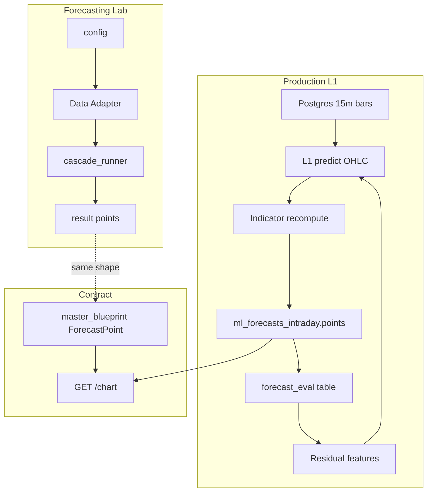

# Unified Forecast Pipeline — Master Plan

**Purpose:** Single entry point for the L1 15m forecast pipeline, forecasting lab, canonical points schema, and eval/residuals. All other plans and docs link here or are linked from here.

---

## Overall concept

The **unified forecast pipeline** spans (1) **lab** — experiments and cascade that emit canonical `points`; (2) **production L1** — 15m predict → recompute indicators on history+pred → write `ml_forecasts_intraday.points`; (3) **canonical ForecastPoint** — same shape in [master_blueprint.md](master_blueprint.md) for both `ml_forecasts.points` and `ml_forecasts_intraday.points`; (4) **forecast_eval** table and **residual features** feeding horizon+1 updates without full retrain; (5) **GET /chart** consuming points without reshaping (fallback when only value/lower/upper).

---

## High-level flow

---

## Implementation order

- **Schema** — points shape (canonical ForecastPoint in blueprint) + forecast_eval table (and indexes).
- **Indicator recompute** — Lab already has it ([ml/forecasting_lab/features/indicators.py](../ml/forecasting_lab/features/indicators.py), attach at Level 1); production uses [technical_indicators_corrected.py](../ml/src/features/technical_indicators_corrected.py) or new indicator_recompute module.
- **L1 15m job** — Predict OHLC → recompute indicators → write full `points[]` to ml_forecasts_intraday (or L1 table).
- **Evaluator** — On 15m bar close, score forecast step(s), insert into forecast_eval (step_index, realized_close, residual_close, residual_pct, metrics).
- **Residual features** — Read last K from forecast_eval; feed into next inference (horizon+1 without retraining).
- **GET /chart** — Consume extended points (OHLC + indicators when present); fallback when only value/lower/upper for backward compatibility.

---

## Related plans and docs

| Doc | Description |
|-----|-------------|
| **L1 15m Forecast Pipeline** | Detailed implementation: points shape (OHLC + indicators), indicator recompute flow, forecast_eval table, residual features, file-level actions. Cursor plan *L1 15m Forecast Pipeline* or, if in repo, [docs/plans/L1_15M_FORECAST_PIPELINE.md](plans/L1_15M_FORECAST_PIPELINE.md). *If the L1 plan lives in Cursor only, add at the top: «Part of: [Forecast Pipeline Master Plan](FORECAST_PIPELINE_MASTER_PLAN.md) (repo).»* |
| **Canonical ForecastPoint** | [master_blueprint.md](master_blueprint.md) — section *Canonical Forecast Point Schema (points JSONB)*. |
| **Intraday storage contract** | [INTRADAY_POINTS_STORAGE_CONTRACT.md](INTRADAY_POINTS_STORAGE_CONTRACT.md) — step semantics, `ts` (UTC ISO), writer normalization. |
| **Deploy + monitor** | [INTRADAY_DEPLOY_AND_MONITOR.md](INTRADAY_DEPLOY_AND_MONITOR.md) — deploy together, RLS/insert, canary checks at 6PM CST. |
| **Architecture rule** | [.cursor/rules/forecasting-architecture-mvp.mdc](../.cursor/rules/forecasting-architecture-mvp.mdc) — schema, GET /chart, temporal hierarchy, forecast_eval. |
| **Implementation mapping** | [FORECASTING_IMPLEMENTATION_MAPPING.md](FORECASTING_IMPLEMENTATION_MAPPING.md) — doc-to-code crosswalk; includes L1 15m + lab section. |
| **Lab** | [ml/forecasting_lab/README.md](../ml/forecasting_lab/README.md) — experiments, cascade, `result["points"]`; [ml/forecasting_lab/schema/points.py](../ml/forecasting_lab/schema/points.py) — `ohlc_steps_to_points`. |
