# feat: Live Trading Executor via TradeStation

## Overview

Add a new `live-trading-executor` Supabase Edge Function that evaluates strategy conditions
(reusing the same signal logic as the paper trading executor) and submits real bracket orders
to TradeStation's brokerage API when signals fire. Runs in parallel with paper trading —
strategies have independent `paper_trading_enabled` and `live_trading_enabled` flags.

**Scope:** Equities margin + futures (v1). Alpaca continues as the market data source;
TradeStation is used exclusively for order execution. Manual trigger pattern (no cron) for
initial launch.

**Key constraints from brainstorm:**
- Approach A: new dedicated Edge Function (isolates live-specific risk logic from paper trading)
- Full bracket orders: entry market order → `POST /orderexecution/ordergroups` with `Type: "BRK"`
- Auto token refresh: 20-min OAuth tokens proactively refreshed from `broker_tokens` DB table
- All 4 circuit breakers required: daily loss limit, max concurrent positions, per-trade size cap, market hours
- Partial fills: accept filled quantity, cancel remainder
- Futures: `@ES`/`@NQ` front-month continuous symbols, contract-multiplier-aware position sizing

---

## Problem Statement

The platform has a fully operational paper trading executor but no live execution pathway.
Users cannot deploy strategies with real capital. The existing `ts-strategies` function is
an abandoned skeleton (references deleted `ts_` tables, no production-ready implementation).
This plan creates a production-grade live executor from scratch, leveraging the battle-tested
patterns from the paper trading executor.

---

## Proposed Solution

### Architecture

```
Signal fires (strategy conditions met)
    │
    ▼
live-trading-executor Edge Function
    │
    ├─ 1. Auth: verify JWT (user must be authenticated)
    ├─ 2. Token: read broker_tokens table, refresh if < 5 min remaining
    ├─ 3. Circuit breakers: daily loss limit / max positions / market hours
    ├─ 4. Account: GET /brokerage/accounts/{id}/balances → compute equity
    ├─ 5. Signal eval: evaluateConditionList() via _shared/strategy-evaluator.ts
    ├─ 6. Position size: (equity × risk_pct) / (|entry - stop_loss| × multiplier)
    ├─ 7. Entry: POST /orderexecution/orders (Market, TradeAction=BUY/SELLSHORT)
    │       └─ Poll order status or stream until FLL/FPR
    ├─ 8. Bracket: POST /orderexecution/ordergroups (Type="BRK", SL + TP legs)
    ├─ 9. Record: INSERT live_trading_positions with broker_order_id, SL/TP order IDs
    └─ 10. Exit monitoring: on bracket leg fill → UPDATE status='closed', record P&L
```

---

## Database Schema (ERD)

```mermaid
erDiagram
    strategies {
        UUID id PK
        UUID user_id FK
        TEXT name
        BOOLEAN paper_trading_enabled
        BOOLEAN live_trading_enabled
        DECIMAL paper_capital
        DECIMAL live_risk_pct
        DECIMAL live_daily_loss_limit_pct
        INT live_max_positions
        DECIMAL live_max_position_pct
    }

    broker_tokens {
        UUID id PK
        UUID user_id FK
        TEXT provider
        TEXT access_token
        TEXT refresh_token
        TIMESTAMPTZ expires_at
        TEXT account_id
        TEXT futures_account_id
        TIMESTAMPTZ created_at
        TIMESTAMPTZ updated_at
    }

    live_trading_positions {
        UUID id PK
        UUID user_id FK
        UUID strategy_id FK
        UUID symbol_id FK
        TEXT timeframe
        DECIMAL entry_price
        DECIMAL current_price
        INT quantity
        TIMESTAMPTZ entry_time
        TEXT direction
        DECIMAL stop_loss_price
        DECIMAL take_profit_price
        TEXT status
        TEXT broker_order_id
        TEXT broker_sl_order_id
        TEXT broker_tp_order_id
        TEXT account_id
        TEXT asset_type
        DECIMAL contract_multiplier
        DECIMAL pnl
        TEXT close_reason
        TIMESTAMPTZ exit_time
        DECIMAL exit_price
        TIMESTAMPTZ created_at
        TIMESTAMPTZ updated_at
    }

    live_trading_trades {
        UUID id PK
        UUID user_id FK
        UUID strategy_id FK
        UUID position_id FK
        TEXT symbol
        TEXT direction
        DECIMAL entry_price
        DECIMAL exit_price
        INT quantity
        DECIMAL pnl
        DECIMAL pnl_pct
        TEXT close_reason
        TEXT broker_order_id
        TIMESTAMPTZ entry_time
        TIMESTAMPTZ exit_time
        TIMESTAMPTZ created_at
    }

    strategies ||--o{ live_trading_positions : "has"
    strategies ||--o{ live_trading_trades : "has"
    live_trading_positions ||--|| live_trading_trades : "closes into"
    broker_tokens }o--|| strategies : "used by user"
```



---

## Implementation Phases

### Phase 1: Database Migrations

**Migration 1:** `20260303100000_broker_tokens.sql`

```sql
-- Stores TradeStation OAuth tokens per user
CREATE TABLE IF NOT EXISTS broker_tokens (
  id                  UUID         PRIMARY KEY DEFAULT gen_random_uuid(),
  user_id             UUID         NOT NULL REFERENCES auth.users(id) ON DELETE CASCADE,
  provider            TEXT         NOT NULL DEFAULT 'tradestation'
                                   CHECK (provider IN ('tradestation')),
  access_token        TEXT         NOT NULL,
  refresh_token       TEXT         NOT NULL,
  expires_at          TIMESTAMPTZ  NOT NULL,
  account_id          TEXT         NOT NULL,          -- equities margin account
  futures_account_id  TEXT,                           -- futures account (optional)
  created_at          TIMESTAMPTZ  DEFAULT NOW(),
  updated_at          TIMESTAMPTZ  DEFAULT NOW(),
  UNIQUE (user_id, provider)
);

-- RLS: user can only see/update their own tokens
ALTER TABLE broker_tokens ENABLE ROW LEVEL SECURITY;
CREATE POLICY "broker_tokens_user_select" ON broker_tokens
  FOR SELECT USING (auth.uid() = user_id);
CREATE POLICY "broker_tokens_user_insert" ON broker_tokens
  FOR INSERT WITH CHECK (auth.uid() = user_id);
CREATE POLICY "broker_tokens_user_update" ON broker_tokens
  FOR UPDATE USING (auth.uid() = user_id);
-- No DELETE policy — tokens must be revoked, not deleted
```

**Migration 2:** `20260303110000_live_trading_tables.sql`

```sql
-- Add live trading columns to strategies
ALTER TABLE strategy_user_strategies
  ADD COLUMN IF NOT EXISTS live_trading_enabled      BOOLEAN      DEFAULT FALSE,
  ADD COLUMN IF NOT EXISTS live_risk_pct             DECIMAL(5,4) DEFAULT 0.02
    CHECK (live_risk_pct > 0 AND live_risk_pct <= 0.10),
  ADD COLUMN IF NOT EXISTS live_daily_loss_limit_pct DECIMAL(5,4) DEFAULT 0.05
    CHECK (live_daily_loss_limit_pct > 0 AND live_daily_loss_limit_pct <= 0.20),
  ADD COLUMN IF NOT EXISTS live_max_positions        INT          DEFAULT 5
    CHECK (live_max_positions > 0 AND live_max_positions <= 20),
  ADD COLUMN IF NOT EXISTS live_max_position_pct     DECIMAL(5,4) DEFAULT 0.02
    CHECK (live_max_position_pct > 0 AND live_max_position_pct <= 0.10);

-- Live trading positions table
CREATE TABLE IF NOT EXISTS live_trading_positions (
  id                   UUID         PRIMARY KEY DEFAULT gen_random_uuid(),
  user_id              UUID         NOT NULL REFERENCES auth.users(id) ON DELETE CASCADE,
  strategy_id          UUID         NOT NULL,
  symbol_id            UUID         NOT NULL,
  timeframe            TEXT         NOT NULL,
  entry_price          DECIMAL(12,4) NOT NULL CHECK (entry_price > 0),
  current_price        DECIMAL(12,4),
  quantity             INT          NOT NULL CHECK (quantity > 0 AND quantity <= 10000),
  entry_time           TIMESTAMPTZ  NOT NULL,
  direction            TEXT         NOT NULL CHECK (direction IN ('long', 'short')),
  stop_loss_price      DECIMAL(12,4) NOT NULL CHECK (stop_loss_price > 0),
  take_profit_price    DECIMAL(12,4) NOT NULL CHECK (take_profit_price > 0),
  status               TEXT         NOT NULL DEFAULT 'pending_entry'
                         CHECK (status IN ('pending_entry','open','pending_close','closed','cancelled')),
  broker_order_id      TEXT,        -- entry order ID
  broker_sl_order_id   TEXT,        -- bracket SL leg order ID
  broker_tp_order_id   TEXT,        -- bracket TP leg order ID
  account_id           TEXT         NOT NULL,
  asset_type           TEXT         NOT NULL DEFAULT 'STOCK'
                         CHECK (asset_type IN ('STOCK','FUTURE')),
  contract_multiplier  DECIMAL(10,2) DEFAULT 1.0 CHECK (contract_multiplier > 0),
  pnl                  DECIMAL(12,4),
  close_reason         TEXT CHECK (close_reason IN (
                         'SL_HIT','TP_HIT','EXIT_SIGNAL','MANUAL_CLOSE',
                         'GAP_FORCED_CLOSE','PARTIAL_FILL_CANCELLED','BROKER_ERROR'
                       )),
  exit_time            TIMESTAMPTZ,
  exit_price           DECIMAL(12,4),
  created_at           TIMESTAMPTZ  DEFAULT NOW(),
  updated_at           TIMESTAMPTZ  DEFAULT NOW(),
  CONSTRAINT live_long_position_levels CHECK (
    (direction = 'long'  AND stop_loss_price < entry_price AND entry_price < take_profit_price) OR
    (direction = 'short' AND take_profit_price < entry_price AND entry_price < stop_loss_price)
  )
);

CREATE INDEX idx_live_positions_user_strategy
  ON live_trading_positions (user_id, strategy_id, symbol_id, status, created_at DESC);
CREATE INDEX idx_live_positions_status
  ON live_trading_positions (status, user_id);
CREATE INDEX idx_live_positions_broker_order
  ON live_trading_positions (broker_order_id) WHERE broker_order_id IS NOT NULL;

-- RLS
ALTER TABLE live_trading_positions ENABLE ROW LEVEL SECURITY;
CREATE POLICY "live_positions_user_select" ON live_trading_positions
  FOR SELECT USING (auth.uid() = user_id);
CREATE POLICY "live_positions_user_insert" ON live_trading_positions
  FOR INSERT WITH CHECK (auth.uid() = user_id);
CREATE POLICY "live_positions_user_update" ON live_trading_positions
  FOR UPDATE USING (auth.uid() = user_id);

-- Immutable audit trail for live trades
CREATE TABLE IF NOT EXISTS live_trading_trades (
  id              UUID         PRIMARY KEY DEFAULT gen_random_uuid(),
  user_id         UUID         NOT NULL REFERENCES auth.users(id) ON DELETE CASCADE,
  strategy_id     UUID         NOT NULL,
  position_id     UUID         NOT NULL REFERENCES live_trading_positions(id),
  symbol          TEXT         NOT NULL,
  direction       TEXT         NOT NULL CHECK (direction IN ('long','short')),
  entry_price     DECIMAL(12,4) NOT NULL,
  exit_price      DECIMAL(12,4) NOT NULL,
  quantity        INT          NOT NULL,
  pnl             DECIMAL(12,4) NOT NULL,
  pnl_pct         DECIMAL(8,4),
  close_reason    TEXT         NOT NULL,
  broker_order_id TEXT,
  entry_time      TIMESTAMPTZ  NOT NULL,
  exit_time       TIMESTAMPTZ  NOT NULL,
  created_at      TIMESTAMPTZ  DEFAULT NOW()
);

-- Prevent UPDATE/DELETE on live_trading_trades (immutable ledger)
CREATE OR REPLACE FUNCTION prevent_live_trade_mutation()
RETURNS TRIGGER LANGUAGE plpgsql AS $$
BEGIN
  RAISE EXCEPTION 'live_trading_trades records are immutable';
END;
$$;
CREATE TRIGGER live_trades_immutable
  BEFORE UPDATE OR DELETE ON live_trading_trades
  FOR EACH ROW EXECUTE FUNCTION prevent_live_trade_mutation();

ALTER TABLE live_trading_trades ENABLE ROW LEVEL SECURITY;
CREATE POLICY "live_trades_user_select" ON live_trading_trades
  FOR SELECT USING (auth.uid() = user_id);
CREATE POLICY "live_trades_user_insert" ON live_trading_trades
  FOR INSERT WITH CHECK (auth.uid() = user_id);
```

**Acceptance criteria:**
- [x] `broker_tokens` table created with unique constraint on `(user_id, provider)`
- [x] `live_trading_positions` mirrors `paper_trading_positions` schema with added broker columns
- [x] `live_trading_trades` is immutable (trigger blocks UPDATE/DELETE)
- [x] All tables have RLS policies
- [x] `strategy_user_strategies` has new live trading config columns
- [x] Migrations follow naming convention `YYYYMMDDHHMMSS_description.sql`

---

### Phase 2: Shared Infrastructure

**2a. `supabase/functions/_shared/strategy-evaluator.ts`**

Extract from `paper-trading-executor/index.ts`:
- Lines 292–399: `evaluateCondition()`, `evaluateConditionList()`
- Lines 589–631: `computeRSI()`, `computeEMA()`, `computeMACD()`, `computeVolumeMA()`
- Export shared types: `Bar`, `Condition`, `ConditionOperator`, `IndicatorCache`
- Both paper and live executors import from this module

Key interfaces:
```typescript
// supabase/functions/_shared/strategy-evaluator.ts
export interface Bar { time: string; open: number; high: number; low: number; close: number; volume: number; }
export type IndicatorCache = Map<string, number>;
export interface Condition { id: string; indicator: string; operator: ConditionOperator; value?: number; crossWith?: string; minValue?: number; maxValue?: number; logicalOp: "AND" | "OR"; parentId?: string; }
export function buildIndicatorCache(bars: Bar[]): IndicatorCache;
export function evaluateConditionList(conditions: Condition[], bars: Bar[], cache: IndicatorCache): boolean;
```

**2b. `supabase/functions/_shared/tradestation-client.ts`**

TradeStation API client wrapping all HTTP calls:

```typescript
// supabase/functions/_shared/tradestation-client.ts

const TS_BASE = "https://api.tradestation.com/v3";
const TS_SIM_BASE = "https://sim-api.tradestation.com/v3";
const TS_AUTH_URL = "https://signin.tradestation.com/oauth/token";

export interface BracketOrderResult {
  entryOrderId: string;
  slOrderId: string;
  tpOrderId: string;
}

export interface AccountBalance {
  equity: number;
  buyingPower: number;
  cashBalance: number;
}

// Token refresh
export async function refreshAccessToken(
  clientId: string,
  clientSecret: string,
  refreshToken: string
): Promise<{ access_token: string; expires_in: number }>

// Account balance
export async function getAccountBalance(
  accessToken: string,
  accountId: string
): Promise<AccountBalance>

// Place entry market order
export async function placeMarketOrder(
  accessToken: string,
  accountId: string,
  symbol: string,
  quantity: number,
  tradeAction: "BUY" | "SELL" | "BUYTOCOVER" | "SELLSHORT"
): Promise<string>  // returns OrderID

// Poll order fill status (up to timeoutMs)
export async function pollOrderFill(
  accessToken: string,
  accountId: string,
  orderId: string,
  timeoutMs: number
): Promise<{ filledQuantity: number; fillPrice: number; status: string }>

// Cancel order remainder
export async function cancelOrder(
  accessToken: string,
  orderId: string
): Promise<void>

// Place bracket order group (SL + TP)
export async function placeBracketOrders(
  accessToken: string,
  accountId: string,
  symbol: string,
  quantity: number,
  tradeAction: "SELL" | "BUYTOCOVER",
  stopLossPrice: number,
  takeProfitPrice: number
): Promise<BracketOrderResult>
```

**Futures symbol normalization** (maps user-input to TradeStation format):
```typescript
// /ES → @ES, /NQ → @NQ (CME notation to TradeStation continuous front month)
export function normalizeSymbol(symbol: string): { tsSymbol: string; isFutures: boolean; multiplier: number }
// Known multipliers: @ES=50, @NQ=20, @RTY=50, @YM=5, @CL=1000, @GC=100
```

**2c. Update `.env.example`**
```
TRADESTATION_CLIENT_ID=
TRADESTATION_CLIENT_SECRET=
```

**Acceptance criteria:**
- [x] `_shared/condition-evaluator.ts` reused (not creating new strategy-evaluator.ts per P2 #098)
- [x] `paper-trading-executor/index.ts` imports from the shared module (no duplication)
- [x] `_shared/tradestation-client.ts` has TypeScript types for all API responses
- [x] `normalizeSymbol()` handles `/ES`, `/NQ`, `ES`, `AAPL` → correct output
- [x] `.env.example` updated with TradeStation secrets

---

### Phase 3: `live-trading-executor` Edge Function

**File:** `supabase/functions/live-trading-executor/index.ts`

Pattern mirrors `paper-trading-executor/index.ts` structure exactly.

#### 3a. Token Management

```typescript
// Read broker_tokens table
async function getBrokerToken(supabase: SupabaseClient, userId: string): Promise<BrokerToken>

// Proactively refresh if expires_at < now() + 5 minutes
async function ensureFreshToken(supabase: SupabaseClient, token: BrokerToken): Promise<string>
// Calls TS_AUTH_URL with grant_type=refresh_token
// Updates broker_tokens table with new access_token + expires_at
```

**Failure mode:** If no `broker_tokens` row exists for the user, return `401` with `code: "broker_not_connected"` — do NOT fall back to service role (see institutional learnings: security anti-pattern).

#### 3b. Circuit Breakers

```typescript
interface CircuitBreakerResult { allowed: boolean; reason?: string; }

// 1. Market hours (9:30am–4:00pm ET, Mon–Fri)
function checkMarketHours(): CircuitBreakerResult

// 2. Daily loss limit
async function checkDailyLossLimit(
  supabase: SupabaseClient, userId: string, strategyId: string,
  currentEquity: number, dailyLossLimitPct: number
): Promise<CircuitBreakerResult>
// Query live_trading_trades WHERE user_id AND exit_time >= today 00:00 ET
// Sum pnl; if sum < -(currentEquity × dailyLossLimitPct) → halt

// 3. Max concurrent positions
async function checkMaxPositions(
  supabase: SupabaseClient, userId: string, maxPositions: number
): Promise<CircuitBreakerResult>
// Count live_trading_positions WHERE user_id AND status IN ('pending_entry','open')

// 4. Per-trade position size cap
function checkPositionSizeCap(
  tradeValue: number, equity: number, maxPct: number
): CircuitBreakerResult
```

#### 3c. Position Sizing

```typescript
function calculateQuantity(
  equity: number,
  riskPct: number,           // e.g., 0.02 = 2%
  entryPrice: number,
  stopLossPrice: number,
  contractMultiplier: number  // 1 for equities, 50 for @ES, etc.
): number {
  const riskDollars = equity * riskPct;
  const stopDistance = Math.abs(entryPrice - stopLossPrice);
  const rawQty = riskDollars / (stopDistance * contractMultiplier);
  return Math.max(1, Math.floor(rawQty));
}
```

#### 3d. Main Execution Cycle

```typescript
// POST handler: execute live trading cycle for symbol/timeframe
async function executeLiveTradingCycle(
  supabase: SupabaseClient, userId: string,
  symbol: string, timeframe: string
): Promise<ExecutionCycleResult>

// Flow:
// 1. Get fresh broker token
// 2. Get account balance (equity for sizing, check daily loss)
// 3. Fetch strategies WHERE symbol_id, timeframe, live_trading_enabled=true
// 4. Fetch bars: ohlc_bars_v2 last 100 bars
// 5. Build indicator cache (via strategy-evaluator.ts)
// 6. For each strategy (semaphore max 5):
//    a. Run circuit breakers
//    b. Check open positions for symbol (one position per strategy per symbol rule)
//    c. Evaluate entry conditions (no open position)
//    d. If entry signal: size → place entry market order → poll fill → place bracket
//    e. Evaluate exit conditions (existing open position)
//    f. If exit signal: cancel bracket → place close market order
//    g. Check bracket fills: poll bracket order status → close position if SL/TP hit
```

#### 3e. Order Execution Flow (Detail)

```typescript
// Entry
async function openLivePosition(
  supabase: SupabaseClient, tsToken: string,
  strategy: LiveStrategy, bars: Bar[], cache: IndicatorCache, balance: AccountBalance
): Promise<ExecutionResult> {
  // 1. Normalize symbol for TradeStation
  const { tsSymbol, isFutures, multiplier } = normalizeSymbol(strategy.symbol);

  // 2. Compute SL/TP from strategy config
  const sl = computeStopLoss(bars[bars.length-1].close, strategy.stopLossPct, direction);
  const tp = computeTakeProfit(bars[bars.length-1].close, strategy.takeProfitPct, direction);

  // 3. Compute quantity
  const qty = calculateQuantity(balance.equity, strategy.liveRiskPct, entry, sl, multiplier);

  // 4. Per-trade size cap check
  const tradeValue = entry * qty * multiplier;
  const capCheck = checkPositionSizeCap(tradeValue, balance.equity, strategy.liveMaxPositionPct);
  if (!capCheck.allowed) return { success: false, error: 'position_size_cap' };

  // 5. Place entry market order
  const entryOrderId = await placeMarketOrder(tsToken, accountId, tsSymbol, qty, tradeAction);

  // 6. Insert position with status='pending_entry'
  const positionId = await insertPendingPosition(supabase, { ...params, broker_order_id: entryOrderId });

  // 7. Poll for fill (max 30 seconds)
  const fill = await pollOrderFill(tsToken, accountId, entryOrderId, 30_000);

  if (fill.status === 'FPR') {
    // Partial fill: accept filled quantity, cancel remainder
    await cancelOrder(tsToken, entryOrderId);
    // Update position quantity to fill.filledQuantity
  }

  if (fill.filledQuantity === 0) {
    // Not filled at all → cancel position
    await updatePositionStatus(supabase, positionId, 'cancelled', 'PARTIAL_FILL_CANCELLED');
    return { success: false, error: 'order_not_filled' };
  }

  // 8. Place bracket (SL + TP)
  const bracket = await placeBracketOrders(tsToken, accountId, tsSymbol,
    fill.filledQuantity, closeAction, sl, tp);

  // 9. Update position: status='open', fill price, bracket order IDs
  await updatePositionToOpen(supabase, positionId, {
    entry_price: fill.fillPrice,
    quantity: fill.filledQuantity,
    broker_sl_order_id: bracket.slOrderId,
    broker_tp_order_id: bracket.tpOrderId,
    status: 'open'
  });
}
```

#### 3f. Bracket Fill Monitoring

```typescript
// Called on each cycle run — checks if any bracket legs filled
async function checkBracketFills(
  supabase: SupabaseClient, tsToken: string, userId: string
): Promise<void> {
  // Fetch all open live positions with bracket order IDs
  const openPositions = await getOpenPositions(supabase, userId);

  for (const pos of openPositions) {
    // Query order status for SL and TP orders
    const slStatus = await getOrderStatus(tsToken, pos.broker_sl_order_id);
    const tpStatus = await getOrderStatus(tsToken, pos.broker_tp_order_id);

    if (slStatus === 'FLL') await closeLivePosition(supabase, pos, slStatus.fillPrice, 'SL_HIT');
    if (tpStatus === 'FLL') await closeLivePosition(supabase, pos, tpStatus.fillPrice, 'TP_HIT');
  }
}

// Close position with optimistic locking (institutional learnings: race condition prevention)
async function closeLivePosition(
  supabase: SupabaseClient, pos: LivePosition, exitPrice: number, reason: string
) {
  // UPDATE live_trading_positions SET status='closed' WHERE id=? AND status='open'
  // Returns 0 rows → concurrent close detected, skip
  // On success → INSERT into live_trading_trades (immutable audit trail)
}
```

**Acceptance criteria:**
- [x] Token refresh fires proactively when `expires_at < now() + 5 min`
- [x] 401 response (not service role fallback) when `broker_tokens` row is missing
- [x] All 4 circuit breakers checked before every entry order
- [x] Position sizing uses `(equity × risk_pct) / (stop_distance × multiplier)`
- [x] Entry market order → poll fill → bracket group is transactional (partial fill handled)
- [x] Optimistic locking on position close (`WHERE status='open'`)
- [x] Bracket fill monitoring updates positions on SL/TP hits
- [x] `live_trading_trades` INSERT on every close (immutable)

---

### Phase 4: Futures Support

**4a. Front-Month Roll Detection**

```typescript
// supabase/functions/_shared/futures-calendar.ts

interface FuturesExpiry {
  symbol: string;     // @ES, @NQ, etc.
  frontMonth: string; // ESH26 (current front month specific contract)
  nextMonth: string;  // ESM26
  expiryDate: Date;   // 3rd Friday of the month (options/futures expiry)
  rollDate: Date;     // expiryDate - 5 business days (roll when < 5 BD to expiry)
}

export function getNearestExpiry(symbol: string): FuturesExpiry
export function shouldRoll(symbol: string): boolean  // true if within 5 business days of expiry
export function getFrontMonthSymbol(symbol: string): string  // @ES → ESH26 (or ESM26 if rolling)
```

**Note:** TradeStation's continuous `@ES` symbol auto-routes to front month, so explicit roll logic
is mainly needed for display, position tracking, and alerts — not for order routing.

**4b. Contract Multipliers Table**

```typescript
// supabase/functions/_shared/futures-calendar.ts
export const FUTURES_MULTIPLIERS: Record<string, number> = {
  "@ES": 50,    // E-mini S&P 500
  "@NQ": 20,    // E-mini Nasdaq-100
  "@RTY": 50,   // E-mini Russell 2000
  "@YM": 5,     // E-mini Dow
  "@CL": 1000,  // Crude Oil
  "@GC": 100,   // Gold
  "@SI": 5000,  // Silver
  "@ZB": 1000,  // 30-Year T-Bond
};
```

**4c. Futures account routing**

The executor must use the `futures_account_id` (ends in `F`) from `broker_tokens` when the
symbol is a futures contract. Equities use `account_id`.

```typescript
const accountToUse = isFutures
  ? token.futures_account_id ?? throw new Error("No futures account configured")
  : token.account_id;
```

**Acceptance criteria:**
- [x] `normalizeSymbol("/ES")` returns `{ tsSymbol: "@ES", isFutures: true, multiplier: 50 }`
- [x] Futures orders use `futures_account_id` from `broker_tokens`
- [x] Position sizing applies contract multiplier (1 ES contract ≠ 1 share)
- [x] `shouldRoll()` returns true within 5 business days of expiry

---

### Phase 5: Strategies Edge Function Updates

**File:** `supabase/functions/strategies/index.ts`

Add `live_trading_enabled` and new config columns to:
- `StrategyRow` interface
- `handleList()` SELECT
- `handleUpdate()` UPDATE payload

```typescript
// Add to StrategyRow interface
live_trading_enabled: boolean;
live_risk_pct: number;
live_daily_loss_limit_pct: number;
live_max_positions: number;
live_max_position_pct: number;
```

**Acceptance criteria:**
- [x] GET /strategies returns `live_trading_enabled` and config fields
- [x] PATCH /strategies accepts and persists all new live config fields
- [ ] Validation rejects `live_risk_pct > 0.10` (10% max) — deferred: DB CHECK constraint handles this

---

### Phase 6: Frontend Toggle (Minimal)

**File:** `frontend/src/components/StrategyBacktestPanel.tsx` (or wherever the strategy editor lives)

Add a `Live Trading` section below the existing `Paper Trading` section with:
- `live_trading_enabled` toggle
- When enabled: show `risk_pct` slider (0.5%–5%), daily loss limit, max positions
- Show live positions count badge on the strategy card

**File:** `frontend/src/components/LiveTradingDashboard.tsx` (new — mirrors PaperTradingDashboard)
- List open `live_trading_positions` with current P&L
- List `live_trading_trades` history
- Display realized P&L, win rate, profit factor

**Acceptance criteria:**
- [x] Live trading toggle is disabled unless `broker_tokens` row exists for the user
- [x] Risk config inputs have range validation matching DB CHECK constraints
- [x] LiveTradingDashboard shows open positions with live price updates

---

## Technical Considerations

### TradeStation API specifics

- **Two-step bracket:** Entry via `POST /orderexecution/orders`, bracket via `POST /orderexecution/ordergroups` with `Type:"BRK"`. These are separate calls — entry must fill before bracket is placed.
- **Futures symbol format:** `@ES` (not `/ES`) for continuous front-month contracts.
- **Rate limits:** 250 requests per 5-minute window for accounts/balances/positions. Do NOT poll tighter than 1 req/sec per account.
- **Token expiry:** 20 minutes (`expires_in: 1200`). Proactively refresh at `t - 60s`.
- **Partial fill detection:** Status code `FPR` = "Partial Fill (Alive)". Cancel remainder via `DELETE /orderexecution/orders/{orderId}`.

### Institutional learnings applied

- **Optimistic locking:** All position closes use `WHERE status='open'` (prevents double-close). Pattern proven in `paper-trading-executor:555`.
- **No service role fallback:** Missing `broker_tokens` → 401, never escalate to service role.
- **Error discrimination:** All errors return typed codes (`auth`, `network`, `insufficient_funds`, `broker_error`, `circuit_breaker`). Network errors (429, 503) retry once with backoff; validation errors (400) do not.
- **Data source isolation:** Live execution fetches current price from TradeStation fill price; all historical bar data still comes from `ohlc_bars_v2` (Alpaca).

---

## System-Wide Impact

### Interaction Graph

```
executeLiveTradingCycle()
  → broker_tokens table (READ access_token, WRITE on refresh)
  → TradeStation /brokerage/accounts/{id}/balances (READ equity)
  → TradeStation /orderexecution/orders (WRITE market entry)
  → TradeStation /brokerage/accounts/{id}/orders/{id} (READ fill status, poll)
  → TradeStation /orderexecution/ordergroups (WRITE bracket)
  → live_trading_positions (INSERT pending_entry → UPDATE open)
  → strategy_user_strategies (READ live_trading_enabled, config)
  → ohlc_bars_v2 (READ bars for signal evaluation)
  → live_trading_trades (INSERT on close — immutable)
```

### Error & Failure Propagation

| Layer | Error | Handling |
|-------|-------|----------|
| Token expired | TradeStation 401 | Refresh token → retry once |
| Token refresh fails | Auth service 400 | Return `broker_auth_failed`, halt execution |
| Market hours check | Circuit breaker | Return `circuit_breaker: market_hours`, skip entry |
| Balance fetch fails | TradeStation 503 | Return `broker_unavailable`, log, skip cycle |
| Entry order rejected | TradeStation 400 | Return `order_rejected: <reason>`, do not insert position |
| Entry not filled in 30s | Timeout | Cancel order, return `order_not_filled`, no position opened |
| Bracket placement fails | TradeStation 4xx | Cancel entry position manually, update status='cancelled' |
| Position close concurrent | DB 0 rows updated | Log `concurrent_close_detected`, no action needed |

### State Lifecycle Risks

- **Orphaned `pending_entry` positions:** If bracket placement fails after entry fills, the position is stuck in `pending_entry`. Mitigation: a cleanup job (or manual review) should detect positions in `pending_entry` > 5 minutes and attempt bracket re-placement or manual close.
- **Stale current_price:** The executor updates `current_price` on open positions each cycle (like paper trading). If the executor isn't called for a long period, P&L display will be stale — this is acceptable for manual-trigger mode.
- **Duplicate bracket orders:** If the executor crashes mid-bracket placement and retries, it could place duplicate bracket orders. Mitigation: check `broker_sl_order_id IS NOT NULL` before placing bracket; skip if already set.

---

## Acceptance Criteria

### Functional Requirements

- [x] A strategy with `live_trading_enabled=true` places a real market order on TradeStation when entry conditions are met
- [x] Bracket (SL + TP) orders are placed immediately after entry fill
- [x] Partial fills are accepted; remainder is cancelled
- [x] All 4 circuit breakers block entry when triggered
- [x] Position sizing uses `(equity × risk_pct) / (|entry - sl| × multiplier)`
- [x] Futures orders use `@ES` format and `futures_account_id`
- [x] Paper trading continues unaffected when live trading is enabled/disabled
- [x] `live_trading_trades` is immutable (trigger blocks UPDATE/DELETE)
- [x] Token auto-refreshes when `expires_at < now() + 5 minutes`

### Non-Functional Requirements

- [x] No service role escalation — missing broker token returns 401
- [x] Optimistic locking prevents double-close of positions
- [x] Rate limit compliance: ≤ 1 balance query per execution cycle
- [x] Semaphore: max 5 concurrent strategy evaluations (same as paper trading)
- [x] All TradeStation API errors are classified and logged

### Quality Gates

- [x] TypeScript compiles without errors (`deno check`)
- [x] `deno lint` passes on new files
- [x] `deno fmt` passes on new files
- [ ] Integration test: entry order → bracket → SL fill → position closed in DB (using TS simulator `sim-api.tradestation.com`) — requires live credentials
- [ ] Circuit breaker unit tests: each of the 4 breakers blocks entry — follow-up
- [ ] Token refresh unit test: expired token triggers refresh before API call — follow-up

---

## Dependencies & Prerequisites

- TradeStation developer account + `client_id` / `client_secret` (must be added as Supabase secrets)
- TradeStation `account_id` (equities margin) and optionally `futures_account_id` stored in `broker_tokens`
- Initial OAuth flow must be completed manually (the executor handles refresh only, not initial authorization)
- Supabase migrations must run before deploying the Edge Function

---

## Risk Analysis & Mitigation

| Risk | Likelihood | Impact | Mitigation |
|------|-----------|--------|------------|
| Real money lost due to bug | Low | Critical | Use TradeStation simulator (`sim-api`) during development/testing |
| TradeStation API down mid-execution | Low | High | Circuit breaker + error logging; no position opened on API failure |
| Token not refreshed in time | Low | Medium | Proactive refresh at t-60s; retry on 401 |
| Duplicate bracket orders | Low | Medium | Check `broker_sl_order_id IS NOT NULL` before placing |
| Orphaned pending_entry positions | Low | Medium | Detect via monitoring; manual close option in dashboard |
| Daily loss limit bypass | Very Low | High | Query uses `exit_time >= today 00:00 ET` — validated on each entry |
| Front-month futures roll mismatch | Low | Medium | Use `@ES` continuous symbol; roll only affects display, not orders |

---

## Documentation Plan

- [x] Update `.env.example` with `TRADESTATION_CLIENT_ID`, `TRADESTATION_CLIENT_SECRET`
- [x] Add comment in `supabase/functions/live-trading-executor/index.ts` explaining two-step bracket flow
- [ ] Add `LIVE_TRADING_SETUP.md` in `docs/` describing OAuth initial authorization flow — follow-up

---

## Sources & References

### Origin

- **Brainstorm document:** [docs/brainstorms/2026-03-03-live-trading-executor-tradestation-brainstorm.md](docs/brainstorms/2026-03-03-live-trading-executor-tradestation-brainstorm.md)
  - Key decisions: Approach A (new dedicated function), TradeStation for execution only, parallel mode, full bracket orders, auto-refresh, Postgres token storage, futures in v1

### Internal References

- Paper trading executor (primary template): `supabase/functions/paper-trading-executor/index.ts:1-1114`
- Shared validators: `supabase/functions/_shared/validators.ts`
- Existing TS OAuth skeleton (reference pattern): `supabase/functions/ts-strategies/index.ts:203-305`
- Paper positions schema: `supabase/migrations/20260225120000_paper_trading_security_v1.sql:11-34`
- Strategies CRUD: `supabase/functions/strategies/index.ts:27-36`
- Institutional learnings (race conditions, JWT, service role): `docs/BACKTESTING_INSTITUTIONAL_LEARNINGS.md`
- Security patterns: `docs/BACKTEST_VISUALS_PAPER_TRADING_LEARNINGS.md`

### External References

- [TradeStation API Docs](https://api.tradestation.com/docs/)
- [TradeStation Order Execution](https://api.tradestation.com/docs/category/order-execution)
- [TradeStation OAuth — Token Refresh](https://api.tradestation.com/docs/fundamentals/authentication/refresh-tokens)
- [TradeStation Rate Limiting](https://api.tradestation.com/docs/fundamentals/rate-limiting)
- [TradeStation Futures Symbology](https://help.tradestation.com/09_01/tradestationhelp/symbology/futures_symbology.htm)
