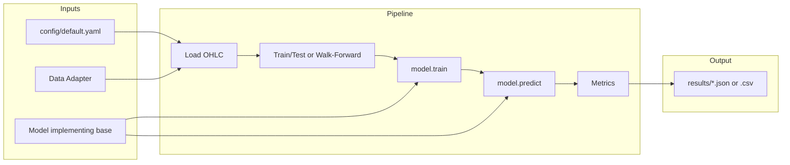

# Forecasting Lab

Standalone **test** forecasting project. Not for production. No writes to `ml_forecasts`, `ohlc_bars_v2`, or any Supabase tables.

**Goal:** Data → train/predict → evaluate → save results locally. Model-agnostic interface so you can plug in XGBoost, Prophet, TimesFM, etc. later.

---

## Architecture

- **Config** (`config/default.yaml`): symbols, horizon, data adapter, walk-forward params, metrics.
- **Data adapters** (`data/`): implement `DataAdapter.load(symbol, start, end, timeframe?)` → DataFrame with `ts`, `close` (and ideally OHLCV). No production DB.
- **Models** (`models/`): implement `BaseForecaster.train(df, target_col, horizon)` and `predict(df, horizon)` → array of length `horizon`.
- **Evaluation** (`evaluation/`): directional accuracy, MAE, MSE; walk-forward splits (time-ordered, no shuffle).
- **Runner** (`runner/run_experiment.py`): load config → resolve adapter → load OHLC → walk-forward → train/predict → compute metrics → write `results/*.json`.



---

## Directory layout

```
ml/forecasting_lab/
├── README.md
├── config/default.yaml
├── data/
│   ├── base.py          # DataAdapter interface
│   ├── yfinance_adapter.py
│   └── csv_adapter.py
├── models/
│   ├── base.py          # BaseForecaster interface
│   ├── naive_forecaster.py
│   └── registry.py      # optional
├── evaluation/
│   ├── metrics.py      # directional_accuracy, mae, mse
│   └── walk_forward.py  # time-ordered splits
├── runner/
│   └── run_experiment.py
├── results/             # run_*.json (gitignored)
└── requirements_lab.txt
```

---

## How to run

From the **ml** directory (so `forecasting_lab` is on the path):

```bash
cd ml
pip install -r forecasting_lab/requirements_lab.txt
python -m forecasting_lab.runner.run_experiment --config forecasting_lab/config/default.yaml --symbol AAPL --model naive
```

Results are written to `forecasting_lab/results/run_YYYYMMDD_HHMMSS.json`.

Optional: `--out-dir <path>` to change the results directory.

---

## How to add a model

1. Create a class in `models/` that inherits from `BaseForecaster`.
2. Implement `train(self, df, target_col="close", horizon=1)` and `predict(self, df, horizon=1)` returning an array-like of length `horizon`.
3. In the runner (or a registry), map a name to the class and pass the instance to `run_experiment(..., model_instance=YourModel())`.

No dependency on `ml/src` production models in the base interface. You can add wrappers in `models/wrappers/` that call existing code and implement the lab interface.

---

## How to add a data source

1. Implement the `DataAdapter` interface in `data/`: `load(symbol, start, end, timeframe?)` returning a DataFrame with at least `ts` and `close`.
2. Register the adapter in `runner/run_experiment.py` in `get_adapter(name)` (and optionally add to config `data_adapter`).

For read-only Supabase OHLC, add e.g. `supabase_read_adapter.py` that only fetches bars; do not write forecasts.

---

## What stays out of scope

- No writes to `ml_forecasts`, `ohlc_bars_v2`, or production Supabase.
- No dependency on `ForecastSynthesizer`, `ForecastServiceV2`, or production ML APIs for the core pipeline.
- Local/CI only; no deployment config.
